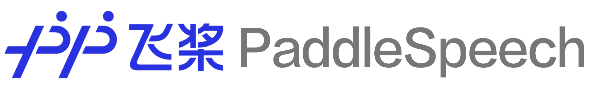

# PaddleSpeech

  

  

  <h3> 
  <a href="https://github.com/Mingxue-Xu/DeepSpeech#quick-start"> Quick Start </a> 
  | <a href="https://github.com/Mingxue-Xu/DeepSpeech#tutorials"> Tutorials </a> 
  | <a href="https://github.com/Mingxue-Xu/DeepSpeech#model-list"> Models List </a> 
  

  
------------------------------------------------------------------------------------

> Notes: Is there any idea to add [Parakeet logo](https://github.com/PaddlePaddle/Parakeet/blob/develop/docs/images/logo.png) into this .md document?

<!---
why they should use your module, 
how they can install it, 
how they can use it
-->

**PaddleSpeech** is an open-source toolkit on [PaddlePaddle](https://github.com/PaddlePaddle/Paddle) platform for two critical tasks in Speech - Automatic Speech Recognition (ASR) and Text-To-Speech Synthesis (TTS), with modules involving state-of-art and influential models.

## Table of Contents

- [Table of Contents](#table-of-contents)
- [Features](#features)
- [Installation](#installation)
- [Quick Start](#quick-start)
- [Models List](#models-list)
- [Tutorials](#tutorials)
- [FAQ and Contributing](#faq-and-contributing)
- [License](#license)
- [Acknowledgement](#acknowledgement)

## Features

Via the easy-to-use, efficient, flexible and scalable implementation, our vision is to empower both industrial application and academic research, including training, inference & testing module, and deployment.

> Note: 1.Better add hyperlinks for code path; 2.The current `Features` is a bit long. Is there any idea to shorten this section?

The features of **ASR** are summarized as follows:
- **Used datasets**
  - Aishell, THCHS30, TIMIT and Librispeech
- **Model support of streaming and non-streaming data**
  - Non-streaming: [Baidu's DeepSpeech2](http://proceedings.mlr.press/v48/amodei16.pdf), [Transformer](https://arxiv.org/abs/1706.03762) and [Conformer](https://arxiv.org/abs/2005.08100)
  - Streaming:  [Baidu's DeepSpeech2](http://proceedings.mlr.press/v48/amodei16.pdf) and [U2](https://arxiv.org/pdf/2012.05481.pdf)
- **Language Model**: Ngram
- **Decoder**: ctc greedy, ctc prefix beam search, greedy, beam search, attention rescore
- **Aligment**: MFA, CTC Aligment
- **Speech Frontend**
  - Audio: Auto Gain
  - Feature: kaldi fbank, kaldi mfcc, linear, delta detla
- **Speech Augmentation**
  - Audio: Auto Gain
  - Feature: Volume Perturbation, Speed Perturbation, Shifting Perturbation, Online Bayesian normalization, Noise Perturbation, Impulse Response,Spectrum, SpecAugment, Adaptive SpecAugment
- **Tokenizer**: Chinese/English Character, English Word, Sentence Piece

- **Word Segmentation**: [mmseg](http://technology.chtsai.org/mmseg/)

The features of **TTS** are summarized as follows:

<!---
Reference docs/source/tts/introduction.md
-->
- **Text FrontEnd**: Rule based *Chinese* frontend.
- **Acoustic Models**: FastSpeech2, SpeedySpeech, TransformerTTS, Tacotron2
- **Vocoders**: Parallel WaveGAN, WaveFlow
- **Voice Cloning**: Transfer Learning from Speaker Verification to Multispeaker Text-To-Speech Synthesis, GE2E

## Installation

> Note: The installation guidance of TTS and ASR is now separated.

Base environment:  
* Ubuntu 16.04
* python>=3.7
* paddlepaddle==2.1.2

Please see the [ASR installation](docs/source/asr/install.md) and [TTS installation](docs/source/tts/install.md) documents for all the alternatives.

## Quick Start

Please see [ASR getting started](docs/source/asr/getting_started.md) ([tiny test](examples/tiny/s0/README.md)) and [TTS Basic Use](/docs/source/tts/basic_usage.md).

## Models List

PaddleSpeech ASR supports a lot of mainstream models. For more information, please refer to [ASRModels](./docs/source/asr/released_model.md).

<!---
The current hyperlinks redirect to [Previous Parakeet](https://github.com/PaddlePaddle/Parakeet/tree/develop/examples). 
-->

PaddleSpeech TTS mainly contains three modules: *Text Frontend*, *Acoustic Model* and *Vocoder*. Models for each are listed as follow:

| Type                  | Dataset   | Model Type            | Link                                                                                                                  |
| --------------------- | --------- | --------------------- | --------------------------------------------------------------------------------------------------------------------- |
| Vocoder               | LJSpeech  | Parallel WaveGAN      | [pwGAN-ljspeech](https://github.com/PaddlePaddle/Parakeet/tree/develop/examples/GANVocoder/parallelwave_gan/ljspeech) |
| Vocoder               | CSMSC     | Parallel WaveGAN      | [pwGAN-csmsc](https://github.com/PaddlePaddle/Parakeet/tree/develop/examples/GANVocoder/parallelwave_gan/baker)       |
| Vocoder               | LJSpeech  | WaveFlow              | [waveflow-ljspeech](https://github.com/PaddlePaddle/Parakeet/tree/develop/examples/waveflow)                          |
| Acoustic Model        | LJSpeech  | FastSpeech2/FastPitch | [fastspeech2-ljspeech](https://github.com/PaddlePaddle/Parakeet/blob/develop/examples/fastspeech2/ljspeech)           |
| Acoustic Model        |  LJSpeech  | TransformerTTS        | [transformer-ljspeech](https://github.com/PaddlePaddle/Parakeet/tree/develop/examples/transformer_tts/ljspeech)       |
| Acoustic Model        | AISHELL-3 | FastSpeech2/FastPitch | [fastspeech2-aishell3](https://github.com/PaddlePaddle/Parakeet/tree/develop/examples/fastspeech2/aishell3)           |
| Acoustic Model        | CSMSC     | FastSpeech2/FastPitch | [fastspeech2-csmsc](https://github.com/PaddlePaddle/Parakeet/tree/develop/examples/fastspeech2/baker)                 |
| Acoustic Model        | CSMSC     | Speedyspeech          | [speedyspeech-csmsc](https://github.com/PaddlePaddle/Parakeet/tree/develop/examples/speedyspeech/baker)               |
| Chinese Text Frontend | BZNSYP    | g2p                   | [chinese-fronted](https://github.com/PaddlePaddle/Parakeet/tree/develop/examples/text_frontend)                       |

## Tutorials 

More background information for ASR, please refer to:

* [Data Prepration](docs/source/asr/data_preparation.md)  
* [Data Augmentation](docs/source/asr/augmentation.md)  
* [Ngram LM](docs/source/asr/ngram_lm.md)  
* [Benchmark](docs/source/asr/benchmark.md)  
* [Relased Model](docs/source/asr/released_model.md)  

For TTS, [TTS Document](https://paddleparakeet.readthedocs.io/en/latest/) is a good guideline.

## FAQ and Contributing

You are warmly welcome to submit questions in [Discussions](https://github.com/PaddlePaddle/DeepSpeech/discussions) and bug reports in [Issues](https://github.com/PaddlePaddle/DeepSpeech/issues)!

Also, we highly appreciate if you would like to contribute to this project!

## License

DeepSpeech is provided under the [Apache-2.0 License](./LICENSE).

## Acknowledgement

DeepSpeech depends on many open source repos. See [References](docs/source/asr/reference.md) for more information.

<code> **Updates on 2021/10/21**: This [README.md](README.md) outline is not completed, especially *from section **Quick Start***.</code>

