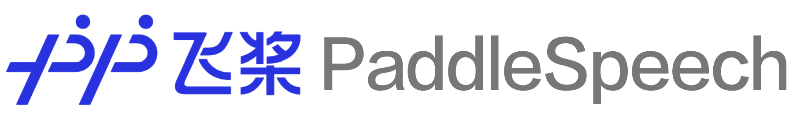

([简体中文](./README_cn.md)|English)
<p align="center">
  
</p>

<p align="center">
    <a href="./LICENSE"></a>
    <a href="https://github.com/PaddlePaddle/PaddleSpeech/releases"></a>
    <a href="support os"></a>
    <a href=""></a>
    <a href="https://github.com/PaddlePaddle/PaddleSpeech/graphs/contributors"></a>
    <a href="https://github.com/PaddlePaddle/PaddleSpeech/commits"></a>
    <a href="https://github.com/PaddlePaddle/PaddleSpeech/issues"></a>
    <a href="https://github.com/PaddlePaddle/PaddleSpeech/stargazers"></a>
    <a href="=https://pypi.org/project/paddlespeech/"></a>
    <a href="=https://pypi.org/project/paddlespeech/"></a>
    <a href="https://huggingface.co/spaces"></a>
</p>
<div align="center">  
<h4>
    <a href="#quick-start"> Quick Start </a>
  | <a href="#documents"> Documents </a>
  | <a href="#model-list"> Models List </a>
  | <a href="https://aistudio.baidu.com/aistudio/course/introduce/25130"> AIStudio Courses </a>
  | <a href="https://arxiv.org/abs/2205.12007"> NAACL2022 Best Demo Award Paper </a>
  | <a href="https://gitee.com/paddlepaddle/PaddleSpeech"> Gitee </a>
</h4>
</div>

------------------------------------------------------------------------------------

**PaddleSpeech** is an open-source toolkit on [PaddlePaddle](https://github.com/PaddlePaddle/Paddle) platform for a variety of critical tasks in speech and audio, with the state-of-art and influential models. 

**PaddleSpeech** won the [NAACL2022 Best Demo Award](https://2022.naacl.org/blog/best-demo-award/), please check out our paper on [Arxiv](https://arxiv.org/abs/2205.12007).

##### Speech Recognition

<div align = "center">
<table style="width:100%">
  <thead>
    <tr>
      <th> Input Audio  </th>
      <th width="550"> Recognition Result  </th>
    </tr>
  </thead>
  <tbody>
   <tr>
      <td align = "center">
      <a href="https://paddlespeech.bj.bcebos.com/PaddleAudio/en.wav" rel="nofollow">
            </a><br>
      </td>
      <td >I knocked at the door on the ancient side of the building.</td>
    </tr>
    <tr>
      <td align = "center">
      <a href="https://paddlespeech.bj.bcebos.com/PaddleAudio/zh.wav" rel="nofollow">
            </a><br>
      </td>
      <td>我认为跑步最重要的就是给我带来了身体健康。</td>
    </tr>
  </tbody>
</table>

</div>

##### Speech Translation (English to Chinese)

<div align = "center">
<table style="width:100%">
  <thead>
    <tr>
      <th> Input Audio  </th>
      <th width="550"> Translations Result  </th>
    </tr>
  </thead>
  <tbody>
   <tr>
      <td align = "center">
      <a href="https://paddlespeech.bj.bcebos.com/PaddleAudio/en.wav" rel="nofollow">
            </a><br>
      </td>
      <td >我 在 这栋 建筑 的 古老 门上 敲门。</td>
    </tr>
  </tbody>
</table>

</div>

##### Text-to-Speech
<div align = "center">
<table style="width:100%">
  <thead>
    <tr>
      <th width="550" > Input Text</th>
      <th>Synthetic Audio</th>
    </tr>
  </thead>
  <tbody>
   <tr>
      <td>Life was like a box of chocolates, you never know what you're gonna get.</td>
      <td align = "center">
      <a href="https://paddlespeech.bj.bcebos.com/Parakeet/docs/demos/tacotron2_ljspeech_waveflow_samples_0.2/sentence_1.wav" rel="nofollow">
            </a><br>
      </td>
    </tr>
    <tr>
      <td>早上好，今天是2020/10/29，最低温度是-3°C。</td>
      <td align = "center">
      <a href="https://paddlespeech.bj.bcebos.com/Parakeet/docs/demos/parakeet_espnet_fs2_pwg_demo/tn_g2p/parakeet/001.wav" rel="nofollow">
            </a><br>
      </td>
    </tr>
    <tr>
      <td>季姬寂，集鸡，鸡即棘鸡。棘鸡饥叽，季姬及箕稷济鸡。鸡既济，跻姬笈，季姬忌，急咭鸡，鸡急，继圾几，季姬急，即籍箕击鸡，箕疾击几伎，伎即齑，鸡叽集几基，季姬急极屐击鸡，鸡既殛，季姬激，即记《季姬击鸡记》。</td>
      <td align = "center">
      <a href="https://paddlespeech.bj.bcebos.com/Parakeet/docs/demos/jijiji.wav" rel="nofollow">
            </a><br>
      </td>
    </tr>
    <tr>
      <td>大家好，我是 parrot 虚拟老师，我们来读一首诗，我与春风皆过客，I and the spring breeze are passing by，你携秋水揽星河，you take the autumn water to take the galaxy。</td>
      <td align = "center">
      <a href="https://paddlespeech.bj.bcebos.com/Parakeet/docs/demos/labixiaoxin.wav" rel="nofollow">
            </a><br>
      </td>
    </tr>
    <tr>
      <td>宜家唔系事必要你讲，但系你所讲嘅说话将会变成呈堂证供。</td>
      <td align = "center">
      <a href="https://paddlespeech.bj.bcebos.com/Parakeet/docs/demos/chengtangzhenggong.wav" rel="nofollow">
            </a><br>
      </td>
    </tr>
    <tr>
      <td>各个国家有各个国家嘅国歌</td>
      <td align = "center">
      <a href="https://paddlespeech.bj.bcebos.com/Parakeet/docs/demos/gegege.wav" rel="nofollow">
            </a><br>
      </td>
    </tr>
  </tbody>
</table>

</div>

For more synthesized audios, please refer to [PaddleSpeech Text-to-Speech samples](https://paddlespeech.readthedocs.io/en/latest/tts/demo.html).

##### Punctuation Restoration
<div align = "center">
<table style="width:100%">
  <thead>
    <tr>
      <th width="390"> Input Text </th>
      <th width="390"> Output Text </th>
    </tr>
  </thead>
  <tbody>
   <tr>
      <td>今天的天气真不错啊你下午有空吗我想约你一起去吃饭</td>
      <td>今天的天气真不错啊！你下午有空吗？我想约你一起去吃饭。</td>
    </tr>
  </tbody>
</table>

</div>


### Features

Via the easy-to-use, efficient, flexible and scalable implementation, our vision is to empower both industrial application and academic research, including training, inference & testing modules, and deployment process. To be more specific, this toolkit features at:
- 📦  **Ease of Use**: low barriers to install, [CLI](#quick-start), [Server](#quick-start-server), and [Streaming Server](#quick-start-streaming-server) is available to quick-start your journey.
- 🏆  **Align to the State-of-the-Art**: we provide high-speed and ultra-lightweight models, and also cutting-edge technology. 
- 🏆  **Streaming ASR and TTS System**: we provide production ready streaming asr and streaming tts system.
- 💯  **Rule-based Chinese frontend**: our frontend contains Text Normalization and Grapheme-to-Phoneme (G2P, including Polyphone and Tone Sandhi). Moreover, we use self-defined linguistic rules to adapt Chinese context.
- 📦  **Varieties of Functions that Vitalize both Industrial and Academia**:
  - 🛎️  *Implementation of critical audio tasks*: this toolkit contains audio functions like  Automatic Speech Recognition, Text-to-Speech Synthesis, Speaker Verfication, KeyWord Spotting, Audio Classification, and Speech Translation, etc.
  - 🔬  *Integration of mainstream models and datasets*: the toolkit implements modules that participate in the whole pipeline of the speech tasks, and uses mainstream datasets like LibriSpeech, LJSpeech, AIShell, CSMSC, etc. See also [model list](#model-list) for more details.
  - 🧩  *Cascaded models application*: as an extension of the typical traditional audio tasks, we combine the workflows of the aforementioned tasks with other fields like Natural language processing (NLP) and Computer Vision (CV).

### Recent Update
- 👑 2023.05.31: Add [WavLM ASR-en](https://github.com/PaddlePaddle/PaddleSpeech/blob/develop/examples/librispeech/asr5), WavLM fine-tuning for ASR on LibriSpeech.
- 👑 2023.05.04: Add [HuBERT ASR-en](https://github.com/PaddlePaddle/PaddleSpeech/blob/develop/examples/librispeech/asr4), HuBERT fine-tuning for ASR on LibriSpeech.
- ⚡ 2023.04.28: Fix [0-d tensor](https://github.com/PaddlePaddle/PaddleSpeech/pull/3214), with the upgrade of paddlepaddle==2.5, the problem of modifying 0-d tensor has been solved.
- 👑 2023.04.25: Add [AMP for U2 conformer](https://github.com/PaddlePaddle/PaddleSpeech/pull/3167).
- 🔥 2023.04.06: Add [subtitle file (.srt format) generation example](./demos/streaming_asr_server).
- 🔥 2023.03.14: Add SVS(Singing Voice Synthesis) examples with Opencpop dataset, including [DiffSinger](./examples/opencpop/svs1)、[PWGAN](./examples/opencpop/voc1) and [HiFiGAN](./examples/opencpop/voc5), the effect is continuously optimized.
- 👑 2023.03.09: Add [Wav2vec2ASR-zh](./examples/aishell/asr3).
- 🎉 2023.03.07: Add [TTS ARM Linux C++ Demo (with C++ Chinese Text Frontend)](./demos/TTSArmLinux).
- 🔥 2023.03.03 Add Voice Conversion [StarGANv2-VC synthesize pipeline](./examples/vctk/vc3).
- 🎉 2023.02.16: Add [Cantonese TTS](./examples/canton/tts3).
- 🔥 2023.01.10: Add [code-switch asr CLI and Demos](./demos/speech_recognition).
- 👑 2023.01.06: Add [code-switch asr tal_cs recipe](./examples/tal_cs/asr1/).
- 🎉 2022.12.02: Add [end-to-end Prosody Prediction pipeline](./examples/csmsc/tts3_rhy) (including using prosody labels in Acoustic Model).
- 🎉 2022.11.30: Add [TTS Android Demo](./demos/TTSAndroid).
- 🤗 2022.11.28: PP-TTS and PP-ASR demos are available in [AIStudio](https://aistudio.baidu.com/aistudio/modelsoverview) and [official website
 of paddlepaddle](https://www.paddlepaddle.org.cn/models).
- 👑 2022.11.18: Add [Whisper CLI and Demos](https://github.com/PaddlePaddle/PaddleSpeech/pull/2640), support multi language recognition and translation.
- 🔥 2022.11.18: Add [Wav2vec2 CLI and Demos](./demos/speech_ssl), Support ASR and Feature Extraction.
- 🎉 2022.11.17: Add [male voice for TTS](https://github.com/PaddlePaddle/PaddleSpeech/pull/2660).
- 🔥 2022.11.07: Add [U2/U2++ C++ High Performance Streaming ASR Deployment](https://github.com/PaddlePaddle/PaddleSpeech/blob/develop/runtime/examples/u2pp_ol/wenetspeech).
- 👑 2022.11.01: Add [Adversarial Loss](https://arxiv.org/pdf/1907.04448.pdf) for [Chinese English mixed TTS](./examples/zh_en_tts/tts3).
- 🔥 2022.10.26: Add [Prosody Prediction](./examples/other/rhy) for TTS.
- 🎉 2022.10.21: Add [SSML](https://github.com/PaddlePaddle/PaddleSpeech/discussions/2538) for TTS Chinese Text Frontend.
- 👑 2022.10.11: Add [Wav2vec2ASR-en](./examples/librispeech/asr3), wav2vec2.0 fine-tuning for ASR on LibriSpeech.
- 🔥 2022.09.26: Add Voice Cloning, TTS finetune, and [ERNIE-SAT](https://arxiv.org/abs/2211.03545) in [PaddleSpeech Web Demo](./demos/speech_web).
- ⚡ 2022.09.09: Add AISHELL-3 Voice Cloning [example](./examples/aishell3/vc2) with ECAPA-TDNN speaker encoder.
- ⚡ 2022.08.25: Release TTS [finetune](./examples/other/tts_finetune/tts3) example.
- 🔥 2022.08.22: Add [ERNIE-SAT](https://arxiv.org/abs/2211.03545) models: [ERNIE-SAT-vctk](./examples/vctk/ernie_sat)、[ERNIE-SAT-aishell3](./examples/aishell3/ernie_sat)、[ERNIE-SAT-zh_en](./examples/aishell3_vctk/ernie_sat).
- 🔥 2022.08.15: Add [g2pW](https://github.com/GitYCC/g2pW) into TTS Chinese Text Frontend.
- 🔥 2022.08.09: Release [Chinese English mixed TTS](./examples/zh_en_tts/tts3).
- ⚡ 2022.08.03: Add ONNXRuntime infer for  TTS CLI.
- 🎉 2022.07.18: Release VITS: [VITS-csmsc](./examples/csmsc/vits)、[VITS-aishell3](./examples/aishell3/vits)、[VITS-VC](./examples/aishell3/vits-vc).
- 🎉 2022.06.22: All TTS models support ONNX format.
- 🍀 2022.06.17: Add [PaddleSpeech Web Demo](./demos/speech_web).
- 👑 2022.05.13: Release [PP-ASR](./docs/source/asr/PPASR.md)、[PP-TTS](./docs/source/tts/PPTTS.md)、[PP-VPR](docs/source/vpr/PPVPR.md).
- 👏🏻 2022.05.06: `PaddleSpeech Streaming Server` is available for `Streaming ASR` with `Punctuation Restoration` and `Token Timestamp` and `Text-to-Speech`.
- 👏🏻 2022.05.06: `PaddleSpeech Server` is available for `Audio Classification`, `Automatic Speech Recognition` and `Text-to-Speech`, `Speaker Verification` and `Punctuation Restoration`.
- 👏🏻 2022.03.28: `PaddleSpeech CLI` is available for `Speaker Verification`.
- 👏🏻 2021.12.10: `PaddleSpeech CLI` is available for `Audio Classification`, `Automatic Speech Recognition`, `Speech Translation (English to Chinese)` and `Text-to-Speech`.

### Community
- Scan the QR code below with your Wechat, you can access to official technical exchange group and get the bonus ( more than 20GB learning materials, such as papers, codes and videos ) and the live link of the lessons. Look forward to your participation.

<div align="center">

</div>

## Installation

We strongly recommend our users to install PaddleSpeech in **Linux** with *python>=3.8* and *paddlepaddle>=2.5.0*.

### **Dependency Introduction**

+ gcc >= 4.8.5
+ paddlepaddle >= 2.5.0
+ python >= 3.8
+ OS support:  Linux(recommend), Windows, Mac OSX

PaddleSpeech depends on paddlepaddle. For installation, please refer to the official website of [paddlepaddle](https://www.paddlepaddle.org.cn/en) and choose according to your own machine. Here is an example of the cpu version.

```bash
pip install paddlepaddle -i https://mirror.baidu.com/pypi/simple
```
You can also specify the version of paddlepaddle or install the develop version. 
```bash
# install 2.4.1 version. Note, 2.4.1 is just an example, please follow the minimum dependency of paddlepaddle for your selection
pip install paddlepaddle==2.4.1 -i https://mirror.baidu.com/pypi/simple
# install develop version
pip install paddlepaddle==0.0.0 -f https://www.paddlepaddle.org.cn/whl/linux/cpu-mkl/develop.html
```

There are two quick installation methods for PaddleSpeech, one is pip installation, and the other is source code compilation (recommended).
### pip install

```shell
pip install pytest-runner
pip install paddlespeech
```

### source code compilation

```shell
git clone https://github.com/PaddlePaddle/PaddleSpeech.git
cd PaddleSpeech
pip install pytest-runner
pip install .
```

For more installation problems, such as conda environment, librosa-dependent, gcc problems, kaldi installation, etc., you can refer to this [installation document](./docs/source/install.md). If you encounter problems during installation, you can leave a message on [#2150](https://github.com/PaddlePaddle/PaddleSpeech/issues/2150) and find related problems


<a name="quickstart"></a>
## Quick Start

Developers can have a try of our models with [PaddleSpeech Command Line](./paddlespeech/cli/README.md) or Python. Change `--input` to test your own audio/text and support 16k wav format audio.

**You can also quickly experience it in AI Studio 👉🏻 [PaddleSpeech API Demo](https://aistudio.baidu.com/aistudio/projectdetail/4353348?sUid=2470186&shared=1&ts=1660876445786)**


Test audio sample download

```shell
wget -c https://paddlespeech.bj.bcebos.com/PaddleAudio/zh.wav
wget -c https://paddlespeech.bj.bcebos.com/PaddleAudio/en.wav
```

### Automatic Speech Recognition

<details><summary>&emsp;（Click to expand）Open Source Speech Recognition</summary>

**command line experience**

```shell
paddlespeech asr --lang zh --input zh.wav
```

**Python API experience**

```python
>>> from paddlespeech.cli.asr.infer import ASRExecutor
>>> asr = ASRExecutor()
>>> result = asr(audio_file="zh.wav")
>>> print(result)
我认为跑步最重要的就是给我带来了身体健康
```
</details>

### Text-to-Speech

<details><summary>&emsp;Open Source Speech Synthesis</summary>

Output 24k sample rate wav format audio


**command line experience**

```shell
paddlespeech tts --input "你好，欢迎使用百度飞桨深度学习框架！" --output output.wav
```

**Python API experience**

```python
>>> from paddlespeech.cli.tts.infer import TTSExecutor
>>> tts = TTSExecutor()
>>> tts(text="今天天气十分不错。", output="output.wav")
```
- You can experience in [Huggingface Spaces](https://huggingface.co/spaces) [TTS Demo](https://huggingface.co/spaces/KPatrick/PaddleSpeechTTS)

</details>

### Audio Classification

<details><summary>&emsp;An open-domain sound classification tool</summary>

Sound classification model based on 527 categories of AudioSet dataset

**command line experience**

```shell
paddlespeech cls --input zh.wav
```

**Python API experience**

```python
>>> from paddlespeech.cli.cls.infer import CLSExecutor
>>> cls = CLSExecutor()
>>> result = cls(audio_file="zh.wav")
>>> print(result)
Speech 0.9027186632156372
```

</details>

### Voiceprint Extraction

<details><summary>&emsp;Industrial-grade voiceprint extraction tool</summary>

**command line experience**

```shell
paddlespeech vector --task spk --input zh.wav
```

**Python API experience**

```python
>>> from paddlespeech.cli.vector import VectorExecutor
>>> vec = VectorExecutor()
>>> result = vec(audio_file="zh.wav")
>>> print(result) # 187维向量
[ -0.19083306   9.474295   -14.122263    -2.0916545    0.04848729
   4.9295826    1.4780062    0.3733844   10.695862     3.2697146
  -4.48199     -0.6617882   -9.170393   -11.1568775   -1.2358263 ...]
```

</details>

### Punctuation Restoration

<details><summary>&emsp;Quick recovery of text punctuation, works with ASR models</summary>

**command line experience**

```shell
paddlespeech text --task punc --input 今天的天气真不错啊你下午有空吗我想约你一起去吃饭
```

**Python API experience**

```python
>>> from paddlespeech.cli.text.infer import TextExecutor
>>> text_punc = TextExecutor()
>>> result = text_punc(text="今天的天气真不错啊你下午有空吗我想约你一起去吃饭")
今天的天气真不错啊！你下午有空吗？我想约你一起去吃饭。
```

</details>

### Speech Translation

<details><summary>&emsp;End-to-end English to Chinese Speech Translation Tool</summary>

Use pre-compiled kaldi related tools, only support experience in Ubuntu system

**command line experience**

```shell
paddlespeech st --input en.wav
```

**Python API experience**

```python
>>> from paddlespeech.cli.st.infer import STExecutor
>>> st = STExecutor()
>>> result = st(audio_file="en.wav")
['我 在 这栋 建筑 的 古老 门上 敲门 。']
```

</details>


<a name="quickstartserver"></a>
## Quick Start Server

Developers can have a try of our speech server with [PaddleSpeech Server Command Line](./paddlespeech/server/README.md).

**You can try it quickly in AI Studio (recommend): [SpeechServer](https://aistudio.baidu.com/aistudio/projectdetail/4354592?sUid=2470186&shared=1&ts=1660877827034)**

**Start server**     

```shell
paddlespeech_server start --config_file ./demos/speech_server/conf/application.yaml
```

**Access Speech Recognition Services**     

```shell
paddlespeech_client asr --server_ip 127.0.0.1 --port 8090 --input input_16k.wav
```

**Access Text to Speech Services**     

```shell
paddlespeech_client tts --server_ip 127.0.0.1 --port 8090 --input "您好，欢迎使用百度飞桨语音合成服务。" --output output.wav
```

**Access Audio Classification Services**     
```shell
paddlespeech_client cls --server_ip 127.0.0.1 --port 8090 --input input.wav
```


For more information about server command lines, please see: [speech server demos](https://github.com/PaddlePaddle/PaddleSpeech/tree/develop/demos/speech_server)


<a name="quickstartstreamingserver"></a>
## Quick Start Streaming Server

Developers can have a try of  [streaming asr](./demos/streaming_asr_server/README.md) and [streaming tts](./demos/streaming_tts_server/README.md) server.

**Start Streaming Speech Recognition Server**

```
paddlespeech_server start --config_file ./demos/streaming_asr_server/conf/application.yaml
```

**Access Streaming Speech Recognition Services**     

```
paddlespeech_client asr_online --server_ip 127.0.0.1 --port 8090 --input input_16k.wav
```

**Start Streaming Text to Speech  Server**

```
paddlespeech_server start --config_file ./demos/streaming_tts_server/conf/tts_online_application.yaml
```

**Access Streaming Text to Speech Services**     

```
paddlespeech_client tts_online --server_ip 127.0.0.1 --port 8092 --protocol http --input "您好，欢迎使用百度飞桨语音合成服务。" --output output.wav
```

For more information please see:  [streaming asr](./demos/streaming_asr_server/README.md) and [streaming tts](./demos/streaming_tts_server/README.md) 

<a name="ModelList"></a>

## Model List

PaddleSpeech supports a series of most popular models. They are summarized in [released models](./docs/source/released_model.md) and attached with available pretrained models.

<a name="SpeechToText"></a>

**Speech-to-Text** contains *Acoustic Model*, *Language Model*, and *Speech Translation*, with the following details:

<table style="width:100%">
  <thead>
    <tr>
      <th>Speech-to-Text Module Type</th>
      <th>Dataset</th>
      <th>Model Type</th>
      <th>Example</th>
    </tr>
  </thead>
  <tbody>
    <tr>
      <td rowspan="4">Speech Recogination</td>
      <td rowspan="2" >Aishell</td>
      <td >DeepSpeech2 RNN + Conv based Models</td>
      <td>
      <a href = "./examples/aishell/asr0">deepspeech2-aishell</a>
      </td>
    </tr>
    <tr>
      <td>Transformer based Attention Models </td>
      <td>
      <a href = "./examples/aishell/asr1">u2.transformer.conformer-aishell</a>
      </td>
    </tr>
    <tr>
      <td> Librispeech</td>
      <td>Transformer based Attention Models </td>
      <td>
      <a href = "./examples/librispeech/asr0">deepspeech2-librispeech</a> / <a href = "./examples/librispeech/asr1">transformer.conformer.u2-librispeech</a>  / <a href = "./examples/librispeech/asr2">transformer.conformer.u2-kaldi-librispeech</a>
      </td>
      </td>
    </tr>
  <tr>
      <td>TIMIT</td>
      <td>Unified Streaming & Non-streaming Two-pass</td>
      <td>
    <a href = "./examples/timit/asr1"> u2-timit</a>
      </td>
  </tr>
  <tr>
  <td>Alignment</td>
  <td>THCHS30</td>
  <td>MFA</td>
  <td>
  <a href = ".examples/thchs30/align0">mfa-thchs30</a>
  </td>
  </tr>
   <tr>
      <td rowspan="1">Language Model</td>
      <td colspan = "2">Ngram Language Model</td>
      <td>
      <a href = "./examples/other/ngram_lm">kenlm</a>
      </td>
    </tr>
  <tr>
      <td rowspan="2">Speech Translation (English to Chinese)</td> 
      <td rowspan="2">TED En-Zh</td>
      <td>Transformer + ASR MTL</td>
      <td>
      <a href = "./examples/ted_en_zh/st0">transformer-ted</a>
      </td>
  </tr>
  <tr>
      <td>FAT + Transformer + ASR MTL</td>
      <td>
      <a href = "./examples/ted_en_zh/st1">fat-st-ted</a>
      </td>
  </tr>
  </tbody>
</table>

<a name="TextToSpeech"></a>

**Text-to-Speech** in PaddleSpeech mainly contains three modules: *Text Frontend*, *Acoustic Model* and *Vocoder*. Acoustic Model and Vocoder models are listed as follow:

<table>
  <thead>
    <tr>
      <th> Text-to-Speech Module Type </th>
      <th> Model Type </th>
      <th> Dataset </th>
      <th> Example </th>
    </tr>
  </thead>
  <tbody>
    <tr>
      <td> Text Frontend </td>
      <td colspan="2"> &emsp; </td>
      <td>
      <a href = "./examples/other/tn">tn</a> / <a href = "./examples/other/g2p">g2p</a>
      </td>
    </tr>
    <tr>
      <td rowspan="6">Acoustic Model</td>
      <td>Tacotron2</td>
      <td>LJSpeech / CSMSC</td>
      <td>
      <a href = "./examples/ljspeech/tts0">tacotron2-ljspeech</a> / <a href = "./examples/csmsc/tts0">tacotron2-csmsc</a>
      </td>
    </tr>
    <tr>
      <td>Transformer TTS</td>
      <td>LJSpeech</td>
      <td>
      <a href = "./examples/ljspeech/tts1">transformer-ljspeech</a>
      </td>
    </tr>
    <tr>
      <td>SpeedySpeech</td>
      <td>CSMSC</td>
      <td >
      <a href = "./examples/csmsc/tts2">speedyspeech-csmsc</a>
      </td>
    </tr>
    <tr>
      <td>FastSpeech2</td>
      <td>LJSpeech / VCTK / CSMSC / AISHELL-3 / ZH_EN / finetune</td>
      <td>
      <a href = "./examples/ljspeech/tts3">fastspeech2-ljspeech</a> / <a href = "./examples/vctk/tts3">fastspeech2-vctk</a> / <a href = "./examples/csmsc/tts3">fastspeech2-csmsc</a> / <a href = "./examples/aishell3/tts3">fastspeech2-aishell3</a> / <a href = "./examples/zh_en_tts/tts3">fastspeech2-zh_en</a> / <a href = "./examples/other/tts_finetune/tts3">fastspeech2-finetune</a>
      </td>
    </tr>
    <tr>
      <td><a href = "https://arxiv.org/abs/2211.03545">ERNIE-SAT</a></td>
      <td>VCTK / AISHELL-3 / ZH_EN</td>
      <td>
      <a href = "./examples/vctk/ernie_sat">ERNIE-SAT-vctk</a> / <a href = "./examples/aishell3/ernie_sat">ERNIE-SAT-aishell3</a> / <a href = "./examples/aishell3_vctk/ernie_sat">ERNIE-SAT-zh_en</a>
      </td>
    </tr>
    <tr>
      <td>DiffSinger</td>
      <td>Opencpop</td>
      <td>
      <a href = "./examples/opencpop/svs1">DiffSinger-opencpop</a>
      </td>
   </tr>
   <tr>
      <td rowspan="6">Vocoder</td>
      <td >WaveFlow</td>
      <td >LJSpeech</td>
      <td>
      <a href = "./examples/ljspeech/voc0">waveflow-ljspeech</a>
      </td>
    </tr>
    <tr>
      <td >Parallel WaveGAN</td>
      <td >LJSpeech / VCTK / CSMSC / AISHELL-3 / Opencpop</td>
      <td>
      <a href = "./examples/ljspeech/voc1">PWGAN-ljspeech</a> / <a href = "./examples/vctk/voc1">PWGAN-vctk</a> / <a href = "./examples/csmsc/voc1">PWGAN-csmsc</a> /  <a href = "./examples/aishell3/voc1">PWGAN-aishell3</a> / <a href = "./examples/opencpop/voc1">PWGAN-opencpop</a>
      </td>
    </tr>
    <tr>
      <td >Multi Band MelGAN</td>
      <td >CSMSC</td>
      <td>
      <a href = "./examples/csmsc/voc3">Multi Band MelGAN-csmsc</a> 
      </td>
    </tr> 
    <tr>
      <td >Style MelGAN</td>
      <td >CSMSC</td>
      <td>
      <a href = "./examples/csmsc/voc4">Style MelGAN-csmsc</a> 
      </td>
    </tr>
    <tr>
      <td>HiFiGAN</td>
      <td>LJSpeech / VCTK / CSMSC / AISHELL-3 / Opencpop</td>
      <td>
      <a href = "./examples/ljspeech/voc5">HiFiGAN-ljspeech</a> / <a href = "./examples/vctk/voc5">HiFiGAN-vctk</a> / <a href = "./examples/csmsc/voc5">HiFiGAN-csmsc</a> / <a href = "./examples/aishell3/voc5">HiFiGAN-aishell3</a> / <a href = "./examples/opencpop/voc5">HiFiGAN-opencpop</a>
      </td>
    </tr>
    <tr>
      <td>WaveRNN</td>
      <td>CSMSC</td>
      <td>
      <a href = "./examples/csmsc/voc6">WaveRNN-csmsc</a>
      </td>
    </tr>
    <tr>
      <td rowspan="5">Voice Cloning</td>
      <td>GE2E</td>
      <td >Librispeech, etc.</td>
      <td>
      <a href = "./examples/other/ge2e">GE2E</a>
      </td>
    </tr>
    <tr>
      <td>SV2TTS (GE2E + Tacotron2)</td>
      <td>AISHELL-3</td>
      <td>
      <a href = "./examples/aishell3/vc0">VC0</a>
      </td>
    </tr>
    <tr>
      <td>SV2TTS (GE2E + FastSpeech2)</td>
      <td>AISHELL-3</td>
      <td>
      <a href = "./examples/aishell3/vc1">VC1</a>
      </td>
    </tr>
    <tr>
      <td>SV2TTS (ECAPA-TDNN + FastSpeech2)</td>
      <td>AISHELL-3</td>
      <td>
      <a href = "./examples/aishell3/vc2">VC2</a>
      </td>
    </tr>
    <tr>
      <td>GE2E + VITS</td>
      <td>AISHELL-3</td>
      <td>
      <a href = "./examples/aishell3/vits-vc">VITS-VC</a>
      </td>
    </tr>
    <tr>
      <td rowspan="3">End-to-End</td>
      <td>VITS</td>
      <td>CSMSC / AISHELL-3</td>
      <td>
      <a href = "./examples/csmsc/vits">VITS-csmsc</a> / <a href = "./examples/aishell3/vits">VITS-aishell3</a>
      </td>
    </tr>
  </tbody>
</table>

<a name="AudioClassification"></a>

**Audio Classification**

<table style="width:100%">
  <thead>
    <tr>
      <th> Task </th>
      <th> Dataset </th>
      <th> Model Type </th>
      <th> Example </th>
    </tr>
  </thead>
  <tbody>
  <tr>
      <td>Audio Classification</td>
      <td>ESC-50</td>
      <td>PANN</td>
      <td>
      <a href = "./examples/esc50/cls0">pann-esc50</a>
      </td>
    </tr>
  </tbody>
</table>

<a name="KeywordSpotting"></a>

**Keyword Spotting**

<table style="width:100%">
  <thead>
    <tr>
      <th> Task </th>
      <th> Dataset </th>
      <th> Model Type </th>
      <th> Example </th>
    </tr>
  </thead>
  <tbody>
  <tr>
      <td>Keyword Spotting</td>
      <td>hey-snips</td>
      <td>MDTC</td>
      <td>
      <a href = "./examples/hey_snips/kws0">mdtc-hey-snips</a>
      </td>
    </tr>
  </tbody>
</table>

<a name="SpeakerVerification"></a>

**Speaker Verification**

<table style="width:100%">
  <thead>
    <tr>
      <th> Task </th>
      <th> Dataset </th>
      <th> Model Type </th>
      <th> Example </th>
    </tr>
  </thead>
  <tbody>
  <tr>
      <td>Speaker Verification</td>
      <td>VoxCeleb1/2</td>
      <td>ECAPA-TDNN</td>
      <td>
      <a href = "./examples/voxceleb/sv0">ecapa-tdnn-voxceleb12</a>
      </td>
    </tr>
  </tbody>
</table>

<a name="SpeakerDiarization"></a>

**Speaker Diarization**

<table style="width:100%">
  <thead>
    <tr>
      <th> Task </th>
      <th> Dataset </th>
      <th> Model Type </th>
      <th> Example </th>
    </tr>
  </thead>
  <tbody>
  <tr>
      <td>Speaker Diarization</td>
     <td>AMI</td>
      <td>ECAPA-TDNN + AHC / SC</td>
      <td>
      <a href = "./examples/ami/sd0">ecapa-tdnn-ami</a>
      </td>
    </tr>
  </tbody>
</table>

<a name="PunctuationRestoration"></a>

**Punctuation Restoration**

<table style="width:100%">
  <thead>
    <tr>
      <th> Task </th>
      <th> Dataset </th>
      <th> Model Type </th>
      <th> Example </th>
    </tr>
  </thead>
  <tbody>
  <tr>
      <td>Punctuation Restoration</td>
      <td>IWLST2012_zh</td>
      <td>Ernie Linear</td>
      <td>
      <a href = "./examples/iwslt2012/punc0">iwslt2012-punc0</a>
      </td>
    </tr>
  </tbody>
</table>

## Documents

Normally, [Speech SoTA](https://paperswithcode.com/area/speech), [Audio SoTA](https://paperswithcode.com/area/audio) and [Music SoTA](https://paperswithcode.com/area/music) give you an overview of the hot academic topics in the related area. To focus on the tasks in PaddleSpeech, you will find the following guidelines are helpful to grasp the core ideas.

- [Installation](./docs/source/install.md)
- [Quick Start](#quickstart)
- [Some Demos](./demos/README.md)
- Tutorials
  - [Automatic Speech Recognition](./docs/source/asr/quick_start.md)
    - [Introduction](./docs/source/asr/models_introduction.md)
    - [Data Preparation](./docs/source/asr/data_preparation.md)
    - [Ngram LM](./docs/source/asr/ngram_lm.md)
  - [Text-to-Speech](./docs/source/tts/quick_start.md)
    - [Introduction](./docs/source/tts/models_introduction.md)
    - [Advanced Usage](./docs/source/tts/advanced_usage.md)
    - [Chinese Rule Based Text Frontend](./docs/source/tts/zh_text_frontend.md)
    - [Test Audio Samples](https://paddlespeech.readthedocs.io/en/latest/tts/demo.html)
  - Speaker Verification
    - [Audio Searching](./demos/audio_searching/README.md)
    - [Speaker Verification](./demos/speaker_verification/README.md)
  - [Audio Classification](./demos/audio_tagging/README.md)
  - [Speech Translation](./demos/speech_translation/README.md)
  - [Speech Server](./demos/speech_server/README.md)
- [Released Models](./docs/source/released_model.md)
  - [Speech-to-Text](#SpeechToText)
  - [Text-to-Speech](#TextToSpeech)
  - [Audio Classification](#AudioClassification)
  - [Speaker Verification](#SpeakerVerification)
  - [Speaker Diarization](#SpeakerDiarization)
  - [Punctuation Restoration](#PunctuationRestoration)
- [Community](#Community)
- [Welcome to contribute](#contribution)
- [License](#License)

The Text-to-Speech module is originally called [Parakeet](https://github.com/PaddlePaddle/Parakeet), and now merged with this repository. If you are interested in academic research about this task, please see [TTS research overview](https://github.com/PaddlePaddle/PaddleSpeech/tree/develop/docs/source/tts#overview). Also, [this document](https://github.com/PaddlePaddle/PaddleSpeech/blob/develop/docs/source/tts/models_introduction.md) is a good guideline for the pipeline components.


## ⭐ Examples
- **[PaddleBoBo](https://github.com/JiehangXie/PaddleBoBo): Use PaddleSpeech TTS to generate virtual human voice.**
  
<div align="center"><a href="https://www.bilibili.com/video/BV1cL411V71o?share_source=copy_web"></a></div>

- [PaddleSpeech Demo Video](https://paddlespeech.readthedocs.io/en/latest/demo_video.html)

- **[VTuberTalk](https://github.com/jerryuhoo/VTuberTalk): Use PaddleSpeech TTS and ASR to clone voice from videos.**

<div align="center">

</div>


## Citation

To cite PaddleSpeech for research, please use the following format.

```text
@inproceedings{zhang2022paddlespeech,
    title = {PaddleSpeech: An Easy-to-Use All-in-One Speech Toolkit},
    author = {Hui Zhang, Tian Yuan, Junkun Chen, Xintong Li, Renjie Zheng, Yuxin Huang, Xiaojie Chen, Enlei Gong, Zeyu Chen, Xiaoguang Hu, dianhai yu, Yanjun Ma, Liang Huang},
    booktitle = {Proceedings of the 2022 Conference of the North American Chapter of the Association for Computational Linguistics: Human Language Technologies: Demonstrations},
    year = {2022},
    publisher = {Association for Computational Linguistics},
}

@InProceedings{pmlr-v162-bai22d,
  title = {{A}$^3${T}: Alignment-Aware Acoustic and Text Pretraining for Speech Synthesis and Editing},
  author = {Bai, He and Zheng, Renjie and Chen, Junkun and Ma, Mingbo and Li, Xintong and Huang, Liang},
  booktitle = {Proceedings of the 39th International Conference on Machine Learning},
  pages = {1399--1411},
  year = {2022},
  volume = {162},
  series = {Proceedings of Machine Learning Research},
  month = {17--23 Jul},
  publisher = {PMLR},
  pdf = {https://proceedings.mlr.press/v162/bai22d/bai22d.pdf},
  url = {https://proceedings.mlr.press/v162/bai22d.html},
}

@inproceedings{zheng2021fused,
  title={Fused acoustic and text encoding for multimodal bilingual pretraining and speech translation},
  author={Zheng, Renjie and Chen, Junkun and Ma, Mingbo and Huang, Liang},
  booktitle={International Conference on Machine Learning},
  pages={12736--12746},
  year={2021},
  organization={PMLR}
}
```

<a name="contribution"></a>
## Contribute to PaddleSpeech

You are warmly welcome to submit questions in [discussions](https://github.com/PaddlePaddle/PaddleSpeech/discussions) and bug reports in [issues](https://github.com/PaddlePaddle/PaddleSpeech/issues)! Also, we highly appreciate if you are willing to contribute to this project!

### Contributors
<p align="center">
<a href="https://github.com/zh794390558"></a>
<a href="https://github.com/Jackwaterveg"></a>
<a href="https://github.com/yt605155624"></a>
<a href="https://github.com/Honei"></a>
<a href="https://github.com/KPatr1ck"></a>
<a href="https://github.com/kuke"></a>
<a href="https://github.com/lym0302"></a>
<a href="https://github.com/SmileGoat"></a>
<a href="https://github.com/xinghai-sun"></a>
<a href="https://github.com/pkuyym"></a>
<a href="https://github.com/LittleChenCc"></a>
<a href="https://github.com/qingen"></a>
<a href="https://github.com/D-DanielYang"></a>
<a href="https://github.com/Mingxue-Xu"></a>
<a href="https://github.com/745165806"></a>
<a href="https://github.com/jerryuhoo"></a>
<a href="https://github.com/WilliamZhang06"></a>
<a href="https://github.com/chrisxu2016"></a>
<a href="https://github.com/iftaken"></a>
<a href="https://github.com/lfchener"></a>
<a href="https://github.com/BarryKCL"></a>
<a href="https://github.com/mmglove"></a>
<a href="https://github.com/gongel"></a>
<a href="https://github.com/luotao1"></a>
<a href="https://github.com/wanghaoshuang"></a>
<a href="https://github.com/kslz"></a>
<a href="https://github.com/JiehangXie"></a>
<a href="https://github.com/david-95"></a>
<a href="https://github.com/THUzyt21"></a>
<a href="https://github.com/buchongyu2"></a>
<a href="https://github.com/iclementine"></a>
<a href="https://github.com/phecda-xu"></a>
<a href="https://github.com/freeliuzc"></a>
<a href="https://github.com/ZeyuChen"></a>
<a href="https://github.com/ccrrong"></a>
<a href="https://github.com/AK391"></a>
<a href="https://github.com/qingqing01"></a>
<a href="https://github.com/0x45f"></a>
<a href="https://github.com/vpegasus"></a>
<a href="https://github.com/ericxk"></a>
<a href="https://github.com/Betterman-qs"></a>
<a href="https://github.com/sneaxiy"></a>
<a href="https://github.com/Doubledongli"></a>
<a href="https://github.com/apps/dependabot"></a>
<a href="https://github.com/kvinwang"></a>
<a href="https://github.com/chenkui164"></a>
<a href="https://github.com/PaddleZhang"></a>
<a href="https://github.com/billishyahao"></a>
<a href="https://github.com/BrightXiaoHan"></a>
<a href="https://github.com/jiqiren11"></a>
<a href="https://github.com/ryanrussell"></a>
<a href="https://github.com/GT-ZhangAcer"></a>
<a href="https://github.com/tensor-tang"></a>
<a href="https://github.com/hysunflower"></a>
<a href="https://github.com/oyjxer"></a>
<a href="https://github.com/JamesLim-sy"></a>
<a href="https://github.com/limpidezza"></a>
<a href="https://github.com/windstamp"></a>
<a href="https://github.com/AshishKarel"></a>
<a href="https://github.com/chesterkuo"></a>
<a href="https://github.com/YDX-2147483647"></a>
<a href="https://github.com/AdamBear"></a>
<a href="https://github.com/wwhu"></a>
<a href="https://github.com/lispc"></a>
<a href="https://github.com/harisankarh"></a>
<a href="https://github.com/pengzhendong"></a>
<a href="https://github.com/Jackiexiao"></a>
</p>

## Acknowledgement
- Many thanks to [HighCWu](https://github.com/HighCWu) for adding [VITS-aishell3](./examples/aishell3/vits) and [VITS-VC](./examples/aishell3/vits-vc) examples.
- Many thanks to [david-95](https://github.com/david-95) for fixing multi-punctuation bug、contributing to multiple program and data, and adding [SSML](https://github.com/PaddlePaddle/PaddleSpeech/discussions/2538) for TTS Chinese Text Frontend. 
- Many thanks to [BarryKCL](https://github.com/BarryKCL) for improving TTS Chinses Frontend based on [G2PW](https://github.com/GitYCC/g2pW).
- Many thanks to [yeyupiaoling](https://github.com/yeyupiaoling)/[PPASR](https://github.com/yeyupiaoling/PPASR)/[PaddlePaddle-DeepSpeech](https://github.com/yeyupiaoling/PaddlePaddle-DeepSpeech)/[VoiceprintRecognition-PaddlePaddle](https://github.com/yeyupiaoling/VoiceprintRecognition-PaddlePaddle)/[AudioClassification-PaddlePaddle](https://github.com/yeyupiaoling/AudioClassification-PaddlePaddle) for years of attention, constructive advice and great help.
- Many thanks to [mymagicpower](https://github.com/mymagicpower) for the Java implementation of ASR upon [short](https://github.com/mymagicpower/AIAS/tree/main/3_audio_sdks/asr_sdk) and [long](https://github.com/mymagicpower/AIAS/tree/main/3_audio_sdks/asr_long_audio_sdk) audio files.
- Many thanks to [JiehangXie](https://github.com/JiehangXie)/[PaddleBoBo](https://github.com/JiehangXie/PaddleBoBo) for developing Virtual Uploader(VUP)/Virtual YouTuber(VTuber) with PaddleSpeech TTS function.
- Many thanks to [745165806](https://github.com/745165806)/[PaddleSpeechTask](https://github.com/745165806/PaddleSpeechTask) for contributing Punctuation Restoration model.
- Many thanks to [kslz](https://github.com/745165806) for supplementary Chinese documents.
- Many thanks to [awmmmm](https://github.com/awmmmm) for contributing fastspeech2 aishell3 conformer pretrained model.
- Many thanks to [phecda-xu](https://github.com/phecda-xu)/[PaddleDubbing](https://github.com/phecda-xu/PaddleDubbing) for developing a dubbing tool with GUI based on PaddleSpeech TTS model.
- Many thanks to [jerryuhoo](https://github.com/jerryuhoo)/[VTuberTalk](https://github.com/jerryuhoo/VTuberTalk) for developing a GUI tool based on PaddleSpeech TTS and code for making datasets from videos based on PaddleSpeech ASR.
- Many thanks to [vpegasus](https://github.com/vpegasus)/[xuesebot](https://github.com/vpegasus/xuesebot) for developing a rasa chatbot,which is able to speak and listen thanks to PaddleSpeech.
- Many thanks to [chenkui164](https://github.com/chenkui164)/[FastASR](https://github.com/chenkui164/FastASR) for the C++ inference implementation of PaddleSpeech ASR.
- Many thanks to [heyudage](https://github.com/heyudage)/[VoiceTyping](https://github.com/heyudage/VoiceTyping) for the real-time voice typing tool implementation of PaddleSpeech ASR streaming services.
- Many thanks to [EscaticZheng](https://github.com/EscaticZheng)/[ps3.9wheel-install](https://github.com/EscaticZheng/ps3.9wheel-install) for the python3.9 prebuilt wheel for PaddleSpeech installation in Windows without Viusal Studio.
Besides, PaddleSpeech depends on a lot of open source repositories. See [references](./docs/source/reference.md) for more information.
- Many thanks to [chinobing](https://github.com/chinobing)/[FastAPI-PaddleSpeech-Audio-To-Text](https://github.com/chinobing/FastAPI-PaddleSpeech-Audio-To-Text) for converting audio to text based on FastAPI and PaddleSpeech.
- Many thanks to [MistEO](https://github.com/MistEO)/[Pallas-Bot](https://github.com/MistEO/Pallas-Bot) for QQ bot based on PaddleSpeech TTS.

<a name="License"></a>
## License

PaddleSpeech is provided under the [Apache-2.0 License](./LICENSE).

## Stargazers over time

[](https://starchart.cc/PaddlePaddle/PaddleSpeech)
