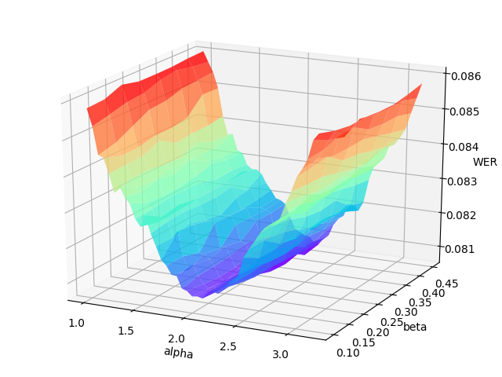
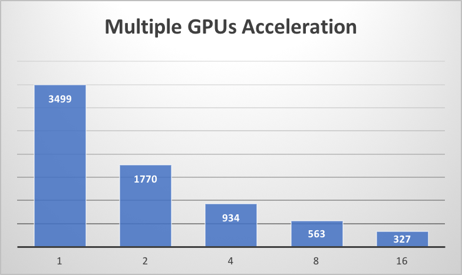

# DeepSpeech2 on PaddlePaddle

[中文版](README_cn.md)

*DeepSpeech2 on PaddlePaddle* is an open-source implementation of end-to-end Automatic Speech Recognition (ASR) engine, based on [Baidu's Deep Speech 2 paper](http://proceedings.mlr.press/v48/amodei16.pdf), with [PaddlePaddle](https://github.com/PaddlePaddle/Paddle) platform. Our vision is to empower both industrial application and academic research on speech recognition, via an easy-to-use, efficient and scalable implementation, including training, inference & testing module, and demo deployment. Besides, several pre-trained models for both English and Mandarin are also released.

## Table of Contents
- [Installation](#installation)
- [Getting Started](#getting-started)
- [Data Preparation](#data-preparation)
- [Training a Model](#training-a-model)
- [Data Augmentation Pipeline](#data-augmentation-pipeline)
- [Inference and Evaluation](#inference-and-evaluation)
- [Running in Docker Container](#running-in-docker-container)
- [Hyper-parameters Tuning](#hyper-parameters-tuning)
- [Training for Mandarin Language](#training-for-mandarin-language)
- [Trying Live Demo with Your Own Voice](#trying-live-demo-with-your-own-voice)
- [Released Models](#released-models)
- [Experiments and Benchmarks](#experiments-and-benchmarks)
- [Questions and Help](#questions-and-help)


## Installation

To avoid the trouble of environment setup, [running in Docker container](#running-in-docker-container) is highly recommended. Otherwise follow the guidelines below to install the dependencies manually.

### Prerequisites
- Python 2.7 only supported
- PaddlePaddle 1.6.0 or later (please refer to the [Installation Guide](https://www.paddlepaddle.org.cn/documentation/docs/en/beginners_guide/index_en.html))

### Setup
- Make sure these libraries or tools installed: `pkg-config`, `flac`, `ogg`, `vorbis`, `boost` and `swig`, e.g. installing them via `apt-get`:

```bash
sudo apt-get install -y pkg-config libflac-dev libogg-dev libvorbis-dev libboost-dev swig python-dev
```

or, installing them via `yum`:

```bash
sudo yum install pkgconfig libogg-devel libvorbis-devel boost-devel python-devel
wget https://ftp.osuosl.org/pub/xiph/releases/flac/flac-1.3.1.tar.xz
xz -d flac-1.3.1.tar.xz
tar -xvf flac-1.3.1.tar
cd flac-1.3.1
./configure
make
make install
```

- Run the setup script for the remaining dependencies

```bash
git clone https://github.com/PaddlePaddle/DeepSpeech.git
cd DeepSpeech
sh setup.sh
```

## Getting Started

Several shell scripts provided in `./examples` will help us to quickly give it a try, for most major modules, including data preparation, model training, case inference and model evaluation, with a few public dataset (e.g. [LibriSpeech](http://www.openslr.org/12/), [Aishell](http://www.openslr.org/33)). Reading these examples will also help you to understand how to make it work with your own data.

Some of the scripts in `./examples` are configured with 8 GPUs. If you don't have 8 GPUs available, please modify `CUDA_VISIBLE_DEVICES`. If you don't have any GPU available, please set `--use_gpu` to False to use CPUs instead. Besides, if out-of-memory problem occurs, just reduce `--batch_size` to fit.

Let's take a tiny sampled subset of [LibriSpeech dataset](http://www.openslr.org/12/) for instance.

- Go to directory

    ```bash
    cd examples/tiny
    ```

    Notice that this is only a toy example with a tiny sampled subset of LibriSpeech. If you would like to try with the complete dataset (would take several days for training), please go to `examples/librispeech` instead.
- Prepare the data

    ```bash
    sh run_data.sh
    ```

    `run_data.sh` will download dataset, generate manifests, collect normalizer's statistics and build vocabulary. Once the data preparation is done, you will find the data (only part of LibriSpeech) downloaded in `./dataset/librispeech` and the corresponding manifest files generated in `./data/tiny` as well as a mean stddev file and a vocabulary file. It has to be run for the very first time you run this dataset and is reusable for all further experiments.
- Train your own ASR model

    ```bash
    sh run_train.sh
    ```

    `run_train.sh` will start a training job, with training logs printed to stdout and model checkpoint of every pass/epoch saved to `./checkpoints/tiny`. These checkpoints could be used for training resuming, inference, evaluation and deployment.
- Case inference with an existing model

    ```bash
    sh run_infer.sh
    ```

    `run_infer.sh` will show us some speech-to-text decoding results for several (default: 10) samples with the trained model. The performance might not be good now as the current model is only trained with a toy subset of LibriSpeech. To see the results with a better model, you can download a well-trained (trained for several days, with the complete LibriSpeech) model and do the inference:

    ```bash
    sh run_infer_golden.sh
    ```
- Evaluate an existing model

    ```bash
    sh run_test.sh
    ```

    `run_test.sh` will evaluate the model with Word Error Rate (or Character Error Rate) measurement. Similarly, you can also download a well-trained model and test its performance:

    ```bash
    sh run_test_golden.sh
    ```

More detailed information are provided in the following sections. Wish you a happy journey with the *DeepSpeech2 on PaddlePaddle* ASR engine!


## Data Preparation

### Generate Manifest

*DeepSpeech2 on PaddlePaddle* accepts a textual **manifest** file as its data set interface. A manifest file summarizes a set of speech data, with each line containing some meta data (e.g. filepath, transcription, duration) of one audio clip, in [JSON](http://www.json.org/) format, such as:

```
{"audio_filepath": "/home/work/.cache/paddle/Libri/134686/1089-134686-0001.flac", "duration": 3.275, "text": "stuff it into you his belly counselled him"}
{"audio_filepath": "/home/work/.cache/paddle/Libri/134686/1089-134686-0007.flac", "duration": 4.275, "text": "a cold lucid indifference reigned in his soul"}
```

To use your custom data, you only need to generate such manifest files to summarize the dataset. Given such summarized manifests, training, inference and all other modules can be aware of where to access the audio files, as well as their meta data including the transcription labels.

For how to generate such manifest files, please refer to `data/librispeech/librispeech.py`, which will download data and generate manifest files for LibriSpeech dataset.

### Compute Mean & Stddev for Normalizer

To perform z-score normalization (zero-mean, unit stddev) upon audio features, we have to estimate in advance the mean and standard deviation of the features, with some training samples:

```bash
python tools/compute_mean_std.py \
--num_samples 2000 \
--specgram_type linear \
--manifest_path data/librispeech/manifest.train \
--output_path data/librispeech/mean_std.npz
```

It will compute the mean and standard deviatio of power spectrum feature with 2000 random sampled audio clips listed in `data/librispeech/manifest.train` and save the results to `data/librispeech/mean_std.npz` for further usage.


### Build Vocabulary

A vocabulary of possible characters is required to convert the transcription into a list of token indices for training, and in decoding, to convert from a list of indices back to text again. Such a character-based vocabulary can be built with `tools/build_vocab.py`.

```bash
python tools/build_vocab.py \
--count_threshold 0 \
--vocab_path data/librispeech/eng_vocab.txt \
--manifest_paths data/librispeech/manifest.train
```

It will write a vocabuary file `data/librispeeech/eng_vocab.txt` with all transcription text in `data/librispeech/manifest.train`, without vocabulary truncation (`--count_threshold 0`).

### More Help

For more help on arguments:

```bash
python data/librispeech/librispeech.py --help
python tools/compute_mean_std.py --help
python tools/build_vocab.py --help
```

## Training a model

`train.py` is the main caller of the training module. Examples of usage are shown below.

- Start training from scratch with 8 GPUs:

    ```
    CUDA_VISIBLE_DEVICES=0,1,2,3,4,5,6,7 python train.py
    ```

- Start training from scratch with CPUs:

    ```
    python train.py --use_gpu False
    ```
- Resume training from a checkpoint:

    ```
    CUDA_VISIBLE_DEVICES=0,1,2,3,4,5,6,7 \
    python train.py \
    --init_from_pretrained_model CHECKPOINT_PATH_TO_RESUME_FROM
    ```

For more help on arguments:

```bash
python train.py --help
```
or refer to `example/librispeech/run_train.sh`.


## Data Augmentation Pipeline

Data augmentation has often been a highly effective technique to boost the deep learning performance. We augment our speech data by synthesizing new audios with small random perturbation (label-invariant transformation) added upon raw audios. You don't have to do the syntheses on your own, as it is already embedded into the data provider and is done on the fly, randomly for each epoch during training.

Six optional augmentation components are provided to be selected, configured and inserted into the processing pipeline.

  - Volume Perturbation
  - Speed Perturbation
  - Shifting Perturbation
  - Online Bayesian normalization
  - Noise Perturbation (need background noise audio files)
  - Impulse Response (need impulse audio files)

In order to inform the trainer of what augmentation components are needed and what their processing orders are, it is required to prepare in advance an *augmentation configuration file* in [JSON](http://www.json.org/) format. For example:

```
[{
    "type": "speed",
    "params": {"min_speed_rate": 0.95,
               "max_speed_rate": 1.05},
    "prob": 0.6
},
{
    "type": "shift",
    "params": {"min_shift_ms": -5,
               "max_shift_ms": 5},
    "prob": 0.8
}]
```

When the `--augment_conf_file` argument of `trainer.py` is set to the path of the above example configuration file, every audio clip in every epoch will be processed: with 60% of chance, it will first be speed perturbed with a uniformly random sampled speed-rate between 0.95 and 1.05, and then with 80% of chance it will be shifted in time with a random sampled offset between -5 ms and 5 ms. Finally this newly synthesized audio clip will be feed into the feature extractor for further training.

For other configuration examples, please refer to `conf/augmenatation.config.example`.

Be careful when utilizing the data augmentation technique, as improper augmentation will do harm to the training, due to the enlarged train-test gap.

## Inference and Evaluation

### Prepare Language Model

A language model is required to improve the decoder's performance. We have prepared two language models (with lossy compression) for users to download and try. One is for English and the other is for Mandarin. Users can simply run this to download the preprared language models:

```bash
cd models/lm
bash download_lm_en.sh
bash download_lm_ch.sh
```

If you wish to train your own better language model, please refer to [KenLM](https://github.com/kpu/kenlm) for tutorials. Here we provide some tips to show how we preparing our English and Mandarin language models. You can take it as a reference when you train your own.

#### English LM

The English corpus is from the [Common Crawl Repository](http://commoncrawl.org) and you can download it from [statmt](http://data.statmt.org/ngrams/deduped_en). We use part en.00 to train our English language model. There are some preprocessing steps before training:

  * Characters not in \['A-Za-z0-9\s'\] (\s represents whitespace characters) are removed and Arabic numbers are converted to English numbers like 1000 to one thousand.
  * Repeated whitespace characters are squeezed to one and the beginning whitespace characters are removed. Notice that all transcriptions are lowercase, so all characters are converted to lowercase.
  * Top 400,000 most frequent words are selected to build the vocabulary and the rest are replaced with 'UNKNOWNWORD'.

Now the preprocessing is done and we get a clean corpus to train the language model. Our released language model are trained with agruments '-o 5 --prune 0 1 1 1 1'. '-o 5' means the max order of language model is 5. '--prune 0 1 1 1 1' represents count thresholds for each order and more specifically it will prune singletons for orders two and higher. To save disk storage we convert the arpa file to 'trie' binary file with arguments '-a 22 -q 8 -b 8'. '-a' represents the maximum number of leading bits of pointers in 'trie' to chop. '-q -b' are quantization parameters for probability and backoff.

#### Mandarin LM

Different from the English language model, Mandarin language model is character-based where each token is a Chinese character. We use internal corpus to train the released Mandarin language models. The corpus contain billions of tokens. The preprocessing has tiny difference from English language model and main steps include:

  * The beginning and trailing whitespace characters are removed.
  * English punctuations and Chinese punctuations are removed.
  * A whitespace character between two tokens is inserted.

Please notice that the released language models only contain Chinese simplified characters. After preprocessing done we can begin to train the language model. The key training arguments for small LM is '-o 5 --prune 0 1 2 4 4' and '-o 5' for large LM. Please refer above section for the meaning of each argument. We also convert the arpa file to binary file using default settings.

### Speech-to-text Inference

An inference module caller `infer.py` is provided to infer, decode and visualize speech-to-text results for several given audio clips. It might help to have an intuitive and qualitative evaluation of the ASR model's performance.

- Inference with GPU:

    ```bash
    CUDA_VISIBLE_DEVICES=0 python infer.py
    ```

- Inference with CPUs:

    ```bash
    python infer.py --use_gpu False
    ```

We provide two types of CTC decoders: *CTC greedy decoder* and *CTC beam search decoder*. The *CTC greedy decoder* is an implementation of the simple best-path decoding algorithm, selecting at each timestep the most likely token, thus being greedy and locally optimal. The [*CTC beam search decoder*](https://arxiv.org/abs/1408.2873) otherwise utilizes a heuristic breadth-first graph search for reaching a near global optimality; it also requires a pre-trained KenLM language model for better scoring and ranking. The decoder type can be set with argument `--decoding_method`.

For more help on arguments:

```
python infer.py --help
```
or refer to `example/librispeech/run_infer.sh`.

### Evaluate a Model

To evaluate a model's performance quantitatively, please run:

- Evaluation with GPUs:

    ```bash
    CUDA_VISIBLE_DEVICES=0,1,2,3,4,5,6,7 python test.py
    ```

- Evaluation with CPUs:

    ```bash
    python test.py --use_gpu False
    ```

The error rate (default: word error rate; can be set with `--error_rate_type`) will be printed.

For more help on arguments:

```bash
python test.py --help
```
or refer to `example/librispeech/run_test.sh`.

## Hyper-parameters Tuning

The hyper-parameters $\alpha$ (language model weight) and $\beta$ (word insertion weight) for the [*CTC beam search decoder*](https://arxiv.org/abs/1408.2873) often have a significant impact on the decoder's performance. It would be better to re-tune them on the validation set when the acoustic model is renewed.

`tools/tune.py` performs a 2-D grid search over the hyper-parameter $\alpha$ and $\beta$. You must provide the range of $\alpha$ and $\beta$, as well as the number of their attempts.

- Tuning with GPU:

    ```bash
    CUDA_VISIBLE_DEVICES=0,1,2,3,4,5,6,7 \
    python tools/tune.py \
    --alpha_from 1.0 \
    --alpha_to 3.2 \
    --num_alphas 45 \
    --beta_from 0.1 \
    --beta_to 0.45 \
    --num_betas 8
    ```

- Tuning with CPU:

    ```bash
    python tools/tune.py --use_gpu False
    ```
 The grid search will print the WER (word error rate) or CER (character error rate) at each point in the hyper-parameters space, and draw the error surface optionally. A proper hyper-parameters range should include the global minima of the error surface for WER/CER, as illustrated in the following figure.

<p align="center">

<br/>An example error surface for tuning on the dev-clean set of LibriSpeech
</p>

Usually, as the figure shows, the variation of language model weight ($\alpha$) significantly affect the performance of CTC beam search decoder. And a better procedure is to first tune on serveral data batches (the number can be specified) to find out the proper range of hyper-parameters, then change to the whole validation set to carray out an accurate tuning.

After tuning, you can reset $\alpha$ and $\beta$ in the inference and evaluation modules to see if they really help improve the ASR performance. For more help

```bash
python tune.py --help
```
or refer to `example/librispeech/run_tune.sh`.

## Running in Docker Container

Docker is an open source tool to build, ship, and run distributed applications in an isolated environment. A Docker image for this project has been provided in [hub.docker.com](https://hub.docker.com) with all the dependencies installed, including the pre-built PaddlePaddle, CTC decoders, and other necessary Python and third-party packages. This Docker image requires the support of NVIDIA GPU, so please make sure its availiability and the [nvidia-docker](https://github.com/NVIDIA/nvidia-docker) has been installed.

Take several steps to launch the Docker image:

- Download the Docker image

```bash
nvidia-docker pull hub.baidubce.com/paddlepaddle/deep_speech_fluid:latest-gpu
```

- Clone this repository

```
git clone https://github.com/PaddlePaddle/DeepSpeech.git
```

- Run the Docker image

```bash
sudo nvidia-docker run -it -v $(pwd)/DeepSpeech:/DeepSpeech hub.baidubce.com/paddlepaddle/deep_speech_fluid:latest-gpu /bin/bash
```
Now go back and start from the [Getting Started](#getting-started) section, you can execute training, inference and hyper-parameters tuning similarly in the Docker container.


## Training for Mandarin Language

The key steps of training for Mandarin language are same to that of English language and we have also provided an example for Mandarin training with Aishell in ```examples/aishell```. As mentioned above, please execute ```sh run_data.sh```, ```sh run_train.sh```, ```sh run_test.sh``` and ```sh run_infer.sh``` to do data preparation, training, testing and inference correspondingly. We have also prepared a pre-trained model (downloaded by ./models/aishell/download_model.sh) for users to try with ```sh run_infer_golden.sh``` and ```sh run_test_golden.sh```. Notice that, different from English LM, the Mandarin LM is character-based and please run ```tools/tune.py``` to find an optimal setting.

## Trying Live Demo with Your Own Voice

Until now, an ASR model is trained and tested qualitatively (`infer.py`) and quantitatively (`test.py`) with existing audio files. But it is not yet tested with your own speech. `deploy/demo_english_server.py` and `deploy/demo_client.py` helps quickly build up a real-time demo ASR engine with the trained model, enabling you to test and play around with the demo, with your own voice.

To start the demo's server, please run this in one console:

```bash
CUDA_VISIBLE_DEVICES=0 \
python deploy/demo_server.py \
--host_ip localhost \
--host_port 8086
```

For the machine (might not be the same machine) to run the demo's client, please do the following installation before moving on.

For example, on MAC OS X:

```bash
brew install portaudio
pip install pyaudio
pip install keyboard
```

Then to start the client, please run this in another console:

```bash
CUDA_VISIBLE_DEVICES=0 \
python -u deploy/demo_client.py \
--host_ip 'localhost' \
--host_port 8086
```

Now, in the client console, press the `whitespace` key, hold, and start speaking. Until finishing your utterance, release the key to let the speech-to-text results shown in the console. To quit the client, just press `ESC` key.

Notice that `deploy/demo_client.py` must be run on a machine with a microphone device, while `deploy/demo_server.py` could be run on one without any audio recording hardware, e.g. any remote server machine. Just be careful to set the `host_ip` and `host_port` argument with the actual accessible IP address and port, if the server and client are running with two separate machines. Nothing should be done if they are running on one single machine.

Please also refer to `examples/deploy_demo/run_english_demo_server.sh`, which will first download a pre-trained English model (trained with 3000 hours of internal speech data) and then start the demo server with the model. With running `examples/mandarin/run_demo_client.sh`, you can speak English to test it. If you would like to try some other models, just update `--model_path` argument in the script.  

For more help on arguments:

```bash
python deploy/demo_server.py --help
python deploy/demo_client.py --help
```

## Released Models

#### Speech Model Released

Language  | Model Name | Training Data | Hours of Speech
:-----------: | :------------: | :----------: |  -------:
English  | [LibriSpeech Model](https://deepspeech.bj.bcebos.com/eng_models/librispeech_model_fluid.tar.gz) | [LibriSpeech Dataset](http://www.openslr.org/12/) | 960 h
English  | [BaiduEN8k Model](https://deepspeech.bj.bcebos.com/demo_models/baidu_en8k_model_fluid.tar.gz) | Baidu Internal English Dataset | 8628 h
Mandarin | [Aishell Model](https://deepspeech.bj.bcebos.com/mandarin_models/aishell_model_fluid.tar.gz) | [Aishell Dataset](http://www.openslr.org/33/) | 151 h
Mandarin | [BaiduCN1.2k Model](https://deepspeech.bj.bcebos.com/demo_models/baidu_cn1.2k_model_fluid.tar.gz) | Baidu Internal Mandarin Dataset | 1204 h

#### Language Model Released

Language Model | Training Data | Token-based | Size | Descriptions
:-------------:| :------------:| :-----: | -----: | :-----------------
[English LM](https://deepspeech.bj.bcebos.com/en_lm/common_crawl_00.prune01111.trie.klm) |  [CommonCrawl(en.00)](http://web-language-models.s3-website-us-east-1.amazonaws.com/ngrams/en/deduped/en.00.deduped.xz) | Word-based | 8.3 GB | Pruned with 0 1 1 1 1; <br/> About 1.85 billion n-grams; <br/> 'trie'  binary with '-a 22 -q 8 -b 8'
[Mandarin LM Small](https://deepspeech.bj.bcebos.com/zh_lm/zh_giga.no_cna_cmn.prune01244.klm) | Baidu Internal Corpus | Char-based | 2.8 GB | Pruned with 0 1 2 4 4; <br/> About 0.13 billion n-grams; <br/> 'probing' binary with default settings
[Mandarin LM Large](https://deepspeech.bj.bcebos.com/zh_lm/zhidao_giga.klm) | Baidu Internal Corpus | Char-based | 70.4 GB | No Pruning; <br/> About 3.7 billion n-grams; <br/> 'probing' binary with default settings

## Experiments and Benchmarks

#### Benchmark Results for English Models (Word Error Rate)

Test Set                | LibriSpeech Model | BaiduEN8K Model
:---------------------  | ---------------:  | -------------------:
LibriSpeech Test-Clean  |   6.85            |   5.41
LibriSpeech Test-Other  |   21.18           |   13.85
VoxForge American-Canadian | 12.12          |   7.13
VoxForge Commonwealth   |   19.82           |   14.93
VoxForge European       |   30.15           |   18.64
VoxForge Indian         |   53.73           |   25.51
Baidu Internal Testset  |   40.75           |   8.48

For reproducing benchmark results on VoxForge data, we provide a script to download data and generate VoxForge dialect manifest files. Please go to ```data/voxforge``` and execute ```sh run_data.sh``` to get VoxForge dialect manifest files. Notice that VoxForge data may keep updating and the generated manifest files may have difference from those we evaluated on.

#### Benchmark Results for Mandarin Model (Character Error Rate)

Test Set                |  BaiduCN1.2k Model
:---------------------  |  -------------------:
Baidu Internal Testset  |   12.64

#### Acceleration with Multi-GPUs

We compare the training time with 1, 2, 4, 8 Tesla V100 GPUs (with a subset of LibriSpeech samples whose audio durations are between 6.0 and 7.0 seconds).  And it shows that a **near-linear** acceleration with multiple GPUs has been achieved. In the following figure, the time (in seconds) cost for training is printed on the blue bars.

<br/>

| # of GPU  | Acceleration Rate |
| --------  | --------------:   |
| 1         | 1.00 X |
| 2         | 1.98 X |
| 4         | 3.73 X |
| 8         | 6.95 X |

`tools/profile.sh` provides such a profiling tool.

## Questions and Help

You are welcome to submit questions and bug reports in [Github Issues](https://github.com/PaddlePaddle/DeepSpeech/issues). You are also welcome to contribute to this project.
