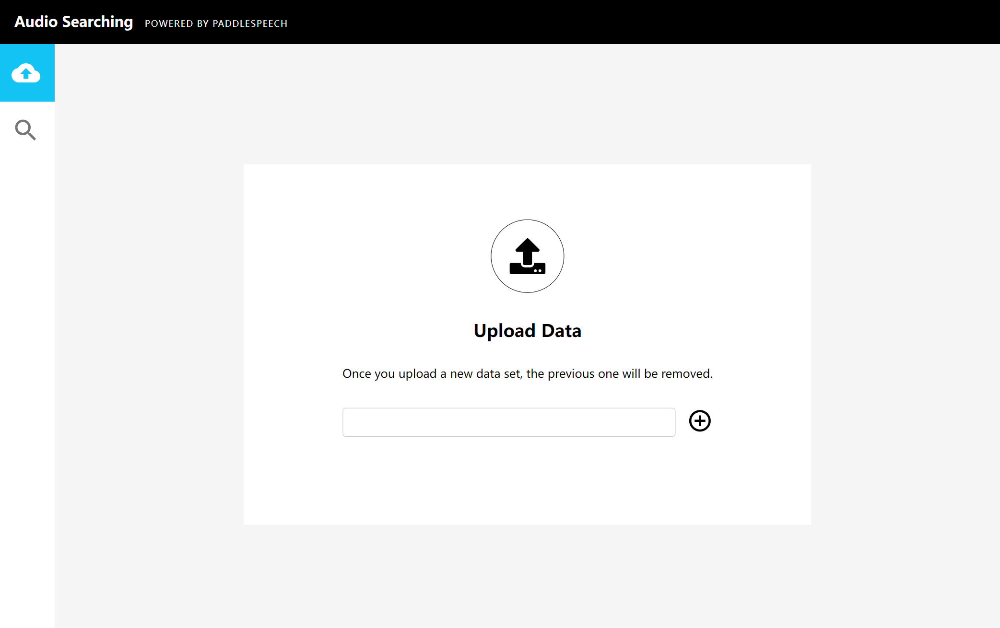

([简体中文](./README_cn.md)|English)

# Audio Searching

## Introduction
As the Internet continues to evolve, unstructured data such as emails, social media photos, live videos, and customer service voice calls have become increasingly common.  If we want to process the data on a computer, we need to use embedding technology to transform the data into vector and store, index, and query it

However, when there is a large amount of data, such as hundreds of millions of audio tracks, it is more difficult to do a similarity search.  The exhaustive method is feasible, but very time consuming.  For this scenario, this demo will introduce how to build an audio similarity retrieval system using the open source vector database Milvus

Audio retrieval (speech, music, speaker, etc.) enables querying and finding similar sounds (or the same speaker) in a large amount of audio data.  The audio similarity retrieval system can be used to identify similar sound effects, minimize intellectual property infringement, quickly retrieve the voice print library, and help enterprises control fraud and identity theft.  Audio retrieval also plays an important role in the classification and statistical analysis of audio data

In this demo, you will learn how to build an audio retrieval system to retrieve similar sound snippets.  The uploaded audio clips are converted into vector data using paddlespeech-based pre-training models (audio classification model, speaker recognition model, etc.) and stored in Milvus.  Milvus automatically generates a unique ID for each vector, then stores the ID and the corresponding audio information (audio ID, audio speaker ID, etc.) in MySQL to complete the library construction.  During retrieval, users upload test audio to obtain vector, and then conduct vector similarity search in Milvus. The retrieval result returned by Milvus is vector ID, and the corresponding audio information can be queried in MySQL by ID


Note：this demo uses the [CN-Celeb](http://openslr.org/82/) dataset of at least 650,000 audio entries and 3000 speakers to build the audio vector library, which is then retrieved using a preset distance calculation. The dataset can also use other,  Adjust as needed, e.g. Librispeech, VoxCeleb, UrbanSound, GloVe, MNIST, etc

## Usage
### 1. Prepare MySQL and Milvus services by docker-compose
The audio similarity search system requires Milvus, MySQL services. We can start these containers with one click through [docker-compose.yaml](./docker-compose.yaml), so please make sure you have [installed Docker Engine](https://docs.docker.com/engine/install/) and [Docker Compose](https://docs.docker.com/compose/install/) before running. then

```bash
docker-compose -f docker-compose.yaml up -d
```

Then you will see the that all containers are created:

```bash
Creating network "quick_deploy_app_net" with driver "bridge"
Creating milvus-minio    ... done
Creating milvus-etcd     ... done
Creating audio-mysql     ... done
Creating milvus-standalone ... done
Creating audio-webclient     ... done
```

And show all containers with `docker ps`, and you can use `docker logs audio-mysql` to get the logs of server container

```bash
CONTAINER ID  IMAGE COMMAND CREATED STATUS  PORTS NAMES
b2bcf279e599  milvusdb/milvus:v2.0.1  "/tini -- milvus run…"  22 hours ago  Up 22 hours 0.0.0.0:19530->19530/tcp  milvus-standalone
d8ef4c84e25c  mysql:5.7 "docker-entrypoint.s…"  22 hours ago  Up 22 hours 0.0.0.0:3306->3306/tcp, 33060/tcp audio-mysql
8fb501edb4f3  quay.io/coreos/etcd:v3.5.0  "etcd -advertise-cli…"  22 hours ago  Up 22 hours 2379-2380/tcp milvus-etcd
ffce340b3790  minio/minio:RELEASE.2020-12-03T00-03-10Z  "/usr/bin/docker-ent…"  22 hours ago  Up 22 hours (healthy) 9000/tcp  milvus-minio
15c84a506754  qingen1/paddlespeech-audio-search-client:2.3  "/bin/bash -c '/usr/…"  22 hours ago  Up 22 hours (healthy) 0.0.0.0:8068->80/tcp  audio-webclient
```

### 2. Start API Server
Then to start the system server, and it provides HTTP backend services.

- Install the Python packages

  ```bash
  pip install -r requirements.txt
  ```
- Set configuration

  ```bash
  vim src/config.py
  ```

  Modify the parameters according to your own environment. Here listing some parameters that need to be set, for more information please refer to [config.py](./src/config.py).

  | **Parameter**    | **Description**                                       | **Default setting** |
  | ---------------- | ----------------------------------------------------- | ------------------- |
  | MILVUS_HOST      | The IP address of Milvus, you can get it by ifconfig. If running everything on one machine, most likely 127.0.0.1 | 127.0.0.1           |
  | MILVUS_PORT      | Port of Milvus.                                       | 19530               |
  | VECTOR_DIMENSION | Dimension of the vectors.                             | 2048                |
  | MYSQL_HOST       | The IP address of Mysql.                              | 127.0.0.1           |
  | MYSQL_PORT       | Port of Milvus.                                       | 3306                |
  | DEFAULT_TABLE    | The milvus and mysql default collection name.         | audio_table          |

- Run the code

  Then start the server with Fastapi.

  ```bash
  export PYTHONPATH=$PYTHONPATH:./src
  python src/main.py
  ```

  Then you will see the Application is started:

  ```bash
  INFO:     Started server process [3949]
  2022-03-07 17:39:14,864 ｜ INFO ｜ server.py ｜ serve ｜ 75 ｜ Started server process [3949]
  INFO:     Waiting for application startup.
  2022-03-07 17:39:14,865 ｜ INFO ｜ on.py ｜ startup ｜ 45 ｜ Waiting for application startup.
  INFO:     Application startup complete.
  2022-03-07 17:39:14,866 ｜ INFO ｜ on.py ｜ startup ｜ 59 ｜ Application startup complete.
  INFO:     Uvicorn running on http://0.0.0.0:8002 (Press CTRL+C to quit)
  2022-03-07 17:39:14,867 ｜ INFO ｜ server.py ｜ _log_started_message ｜ 206 ｜ Uvicorn running on http://0.0.0.0:8002 (Press CTRL+C to quit)
  ```

### 3. Usage
- Prepare data
  ```bash
  wget -c https://www.openslr.org/resources/82/cn-celeb_v2.tar.gz && tar -xvf cn-celeb_v2.tar.gz 
  ```
  Note: If you want to build a quick demo, you can use ./src/test_main.py:download_audio_data function, it downloads 20 audio files , Subsequent results show this collection as an example
 
 - scripts test (recommend!)

    The internal process is downloading data, loading the Paddlespeech model, extracting embedding, storing library, retrieving and deleting library  
    ```bash
    python ./src/test_main.py
    ```

    Output：
    ```bash
    Checkpoint path: %your model path%
    Extracting feature from audio No. 1 , 20 audios in total
    Extracting feature from audio No. 2 , 20 audios in total
    ...
    2022-03-09 17:22:13,870 ｜ INFO ｜ main.py ｜ load_audios ｜ 85 ｜ Successfully loaded data, total count: 20
    2022-03-09 17:22:13,898 ｜ INFO ｜ main.py ｜ count_audio ｜ 147 ｜ Successfully count the number of data!
    2022-03-09 17:22:13,918 ｜ INFO ｜ main.py ｜ audio_path ｜ 57 ｜ Successfully load audio: ./example_audio/test.wav
    ...
    2022-03-09 17:22:32,580 ｜ INFO ｜ main.py ｜ search_local_audio ｜ 131 ｜ search result http://testserver/data?audio_path=./example_audio/test.wav, distance 0.0
    2022-03-09 17:22:32,580 ｜ INFO ｜ main.py ｜ search_local_audio ｜ 131 ｜ search result http://testserver/data?audio_path=./example_audio/knife_chopping.wav, distance 0.021805256605148315
    2022-03-09 17:22:32,580 ｜ INFO ｜ main.py ｜ search_local_audio ｜ 131 ｜ search result http://testserver/data?audio_path=./example_audio/knife_cut_into_flesh.wav, distance 0.052762262523174286
    ...
    2022-03-09 17:22:32,582 ｜ INFO ｜ main.py ｜ search_local_audio ｜ 135 ｜ Successfully searched similar audio!
    2022-03-09 17:22:33,658 ｜ INFO ｜ main.py ｜ drop_tables ｜ 159 ｜ Successfully drop tables in Milvus and MySQL!
    ```
- GUI test (optional)
  
    Navigate to 127.0.0.1:8068 in your browser to access the front-end interface

    Note: If the browser and the service are not on the same machine, then the IP needs to be changed to the IP of the machine where the service is located, and the corresponding API_URL in docker-compose.yaml needs to be changed and the service can be restarted

    - Insert data

      Download the data and decompress it to a path named /home/speech/data. Then enter /home/speech/data in the address bar of the upload page to upload the data  
    
      

    - Search for similar audio

      Select the magnifying glass icon on the left side of the interface. Then, press the "Default Target Audio File" button and upload a .wav sound file you'd like to search. Results will be displayed

      

### 4.Result

 machine configuration：
- OS: CentOS release 7.6 
- kernel：4.17.11-1.el7.elrepo.x86_64
- CPU：Intel(R) Xeon(R) CPU E5-2620 v4 @ 2.10GHz 
- memory：132G

dataset：
- CN-Celeb, train size 650,000, test size 10,000, dimention 192, distance L2

recall and elapsed time statistics are shown in the following figure：

  


The retrieval framework based on Milvus takes about 2.9 milliseconds to retrieve on the premise of 90% recall rate, and it takes about 500 milliseconds for feature extraction (testing audio takes about 5 seconds), that is, a single audio test takes about 503 milliseconds in total, which can meet most application scenarios

### 5.Pretrained Models

Here is a list of pretrained models released by PaddleSpeech :

| Model | Sample Rate
| :--- | :---: 
| ecapa_tdnn | 16000
| panns_cnn6| 32000
| panns_cnn10| 32000
| panns_cnn14| 32000
