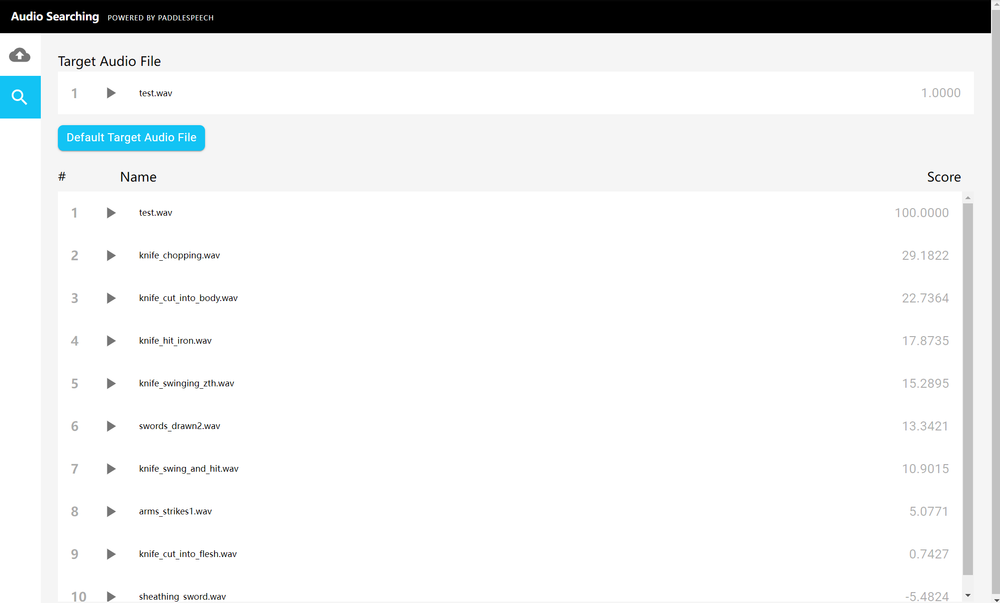
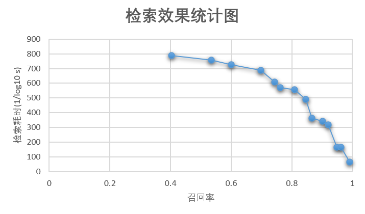

(简体中文|[English](./README.md))

# 音频相似性检索
## 介绍

随着互联网不断发展，电子邮件、社交媒体照片、直播视频、客服语音等非结构化数据已经变得越来越普遍。如果想要使用计算机来处理这些数据，需要使用 embedding 技术将这些数据转化为向量 vector，然后进行存储、建索引、并查询。

但是，当数据量很大，比如上亿条音频要做相似度搜索，就比较困难了。穷举法固然可行，但非常耗时。针对这种场景，该 demo 将介绍如何使用开源向量数据库 Milvus 搭建音频相似度检索系统。

音频检索（如演讲、音乐、说话人等检索）实现了在海量音频数据中查询并找出相似声音（或相同说话人）片段。音频相似性检索系统可用于识别相似的音效、最大限度减少知识产权侵权等，还可以快速的检索声纹库、帮助企业控制欺诈和身份盗用等。在音频数据的分类和统计分析中，音频检索也发挥着重要作用。

在本 demo 中，你将学会如何构建一个音频检索系统，用来检索相似的声音片段。使用基于 PaddleSpeech 预训练模型（音频分类模型，说话人识别模型等）将上传的音频片段转换为向量数据，并存储在 Milvus 中。Milvus 自动为每个向量生成唯一的 ID，然后将 ID 和 相应的音频信息（音频id，音频的说话人id等等）存储在 MySQL，这样就完成建库的工作。用户在检索时，上传测试音频，得到向量，然后在 Milvus 中进行向量相似度搜索，Milvus 返回的检索结果为向量 ID，通过 ID 在 MySQL 内部查询相应的音频信息即可。


注：该 demo 使用 [CN-Celeb](http://openslr.org/82/) 数据集，包括至少 650000 条音频，3000 个说话人，来建立音频向量库（音频特征，或音频说话人特征），然后通过预设的距离计算方式进行音频（或说话人）检索，这里面数据集也可以使用其他的，根据需要调整，如Librispeech，VoxCeleb，UrbanSound，GloVe，MNIST等。

## 使用方法
### 1. PaddleSpeech 安装
音频向量的提取需要用到基于 PaddleSpeech 训练的模型，所以请确保在运行之前已经安装了 PaddleSpeech，具体安装步骤，详见[安装文档](https://github.com/PaddlePaddle/PaddleSpeech/blob/develop/docs/source/install_cn.md)。

你可以从 easy，medium，hard 三种方式中选择一种方式安装。

### 2. MySQL 和 Milvus 安装
音频相似性的检索需要用到 Milvus, MySQL 服务。 我们可以通过 [docker-compose.yaml](./docker-compose.yaml) 一键启动这些容器，所以请确保在运行之前已经安装了 [Docker Engine](https://docs.docker.com/engine/install/) 和 [Docker Compose](https://docs.docker.com/compose/install/)。 即

```bash
## 先进入到 audio_searching 目录，如下示例
cd ~/PaddleSpeech/demos/audio_searching/

## 然后启动容器内的相关服务
docker-compose -f docker-compose.yaml up -d
```

你会看到所有的容器都被创建:

```bash
Creating network "quick_deploy_app_net" with driver "bridge"
Creating milvus-minio    ... done
Creating milvus-etcd     ... done
Creating audio-mysql     ... done
Creating milvus-standalone ... done
Creating audio-webclient     ... done
```

可以采用'docker ps'来显示所有的容器，还可以使用'docker logs audio-mysql'来获取服务器容器的日志：

```bash
CONTAINER ID  IMAGE COMMAND CREATED STATUS  PORTS NAMES
b2bcf279e599  milvusdb/milvus:v2.0.1  "/tini -- milvus run…"  22 hours ago  Up 22 hours 0.0.0.0:19530->19530/tcp  milvus-standalone
d8ef4c84e25c  mysql:5.7 "docker-entrypoint.s…"  22 hours ago  Up 22 hours 0.0.0.0:3306->3306/tcp, 33060/tcp audio-mysql
8fb501edb4f3  quay.io/coreos/etcd:v3.5.0  "etcd -advertise-cli…"  22 hours ago  Up 22 hours 2379-2380/tcp milvus-etcd
ffce340b3790  minio/minio:RELEASE.2020-12-03T00-03-10Z  "/usr/bin/docker-ent…"  22 hours ago  Up 22 hours (healthy) 9000/tcp  milvus-minio
15c84a506754  paddlepaddle/paddlespeech-audio-search-client:2.3  "/bin/bash -c '/usr/…"  22 hours ago  Up 22 hours (healthy) 0.0.0.0:8068->80/tcp  audio-webclient

```

### 3. 配置并启动 API 服务
启动系统服务程序，它会提供基于 HTTP 后端服务。

- 安装服务依赖的 python 基础包

  ```bash
  pip install -r requirements.txt
  ```
- 修改配置(本地运行情况下，一般不用修改，可以跳过该步骤)

  ```bash
  ## 方法一：修改源码文件
  vim src/config.py

  ## 方法二：修改环境变量，如下所示
  export MILVUS_HOST=127.0.0.1
  export MYSQL_HOST=127.0.0.1
  ```

  这里列出了一些需要设置的参数，更多信息请参考 [config.py](./src/config.py)

  | **参数**    | **描述**                | **默认设置** |
  | ---------------- | -------------------- | ------------------- |
  | MILVUS_HOST      | Milvus 服务的 IP 地址 | 127.0.0.1           |
  | MILVUS_PORT      | Milvus 服务的端口号   | 19530               |
  | VECTOR_DIMENSION | 特征向量的维度        | 192                 |
  | MYSQL_HOST       | Mysql 服务的 IP 地址  | 127.0.0.1           |
  | MYSQL_PORT       | Mysql 服务的端口号    | 3306                |
  | DEFAULT_TABLE    | 默认存储的表名        | audio_table         |

- 运行程序

  启动用 Fastapi 构建的服务

  ```bash
  export PYTHONPATH=$PYTHONPATH:./src:../../paddleaudio
  python src/audio_search.py
  ```

  然后你会看到应用程序启动:

  ```bash
  INFO:     Started server process [13352]
  2022-03-26 22:45:30,838 ｜ INFO ｜ server.py ｜ serve ｜ 75 ｜ Started server process [13352]
  INFO:     Waiting for application startup.
  2022-03-26 22:45:30,839 ｜ INFO ｜ on.py ｜ startup ｜ 45 ｜ Waiting for application startup.
  INFO:     Application startup complete.
  2022-03-26 22:45:30,839 ｜ INFO ｜ on.py ｜ startup ｜ 59 ｜ Application startup complete.
  INFO:     Uvicorn running on http://0.0.0.0:8002 (Press CTRL+C to quit)
  2022-03-26 22:45:30,840 ｜ INFO ｜ server.py ｜ _log_started_message ｜ 206 ｜ Uvicorn running on http://0.0.0.0:8002 (Press CTRL+C to quit)
  ```

### 4. 测试方法
- 准备数据
  ```bash
  wget -c https://www.openslr.org/resources/82/cn-celeb_v2.tar.gz && tar -xvf cn-celeb_v2.tar.gz 
  ```
  **注**：如果希望快速搭建 demo，可以采用 ./src/test_audio_search.py:download_audio_data 内部的 20 条音频，另外后续结果展示以该集合为例

- 准备模型（如果使用默认模型，可以跳过此步骤）
  ```bash
  ## 修改模型配置参数，目前 model 仅支持 ecapatdnn_voxceleb12，后续将支持多种类型
  vim ./src/encode.py
  ```
 
 - 脚本测试（推荐）

    ```bash
    python ./src/test_audio_search.py
    ```
    注：内部将依次下载数据，加载 paddlespeech 模型，提取 embedding，存储建库，检索，删库

    输出：
    ```bash
    Downloading https://paddlespeech.bj.bcebos.com/vector/audio/example_audio.tar.gz ...
    ...
    Unpacking ./example_audio.tar.gz ...
    [2022-03-26 22:50:54,987] [    INFO] - checking the aduio file format......
    [2022-03-26 22:50:54,987] [    INFO] - The sample rate is 16000
    [2022-03-26 22:50:54,987] [    INFO] - The audio file format is right
    [2022-03-26 22:50:54,988] [    INFO] - device type: cpu
    [2022-03-26 22:50:54,988] [    INFO] - load the pretrained model: ecapatdnn_voxceleb12-16k
    [2022-03-26 22:50:54,990] [    INFO] - Downloading sv0_ecapa_tdnn_voxceleb12_ckpt_0_1_0.tar.gz from https://paddlespeech.bj.bcebos.com/vector/voxceleb/sv0_ecapa_tdnn_voxceleb12_ckpt_0_1_0.tar.gz
    ...
    [2022-03-26 22:51:17,285] [    INFO] - start to dynamic import the model class
    [2022-03-26 22:51:17,285] [    INFO] - model name ecapatdnn
    [2022-03-26 22:51:23,864] [    INFO] - start to set the model parameters to model
    [2022-03-26 22:54:08,115] [    INFO] - create the model instance success
    [2022-03-26 22:54:08,116] [    INFO] - Preprocess audio file: /home/zhaoqingen/PaddleSpeech/demos/audio_
    searching/example_audio/knife_hit_iron3.wav
    [2022-03-26 22:54:08,116] [    INFO] - load the audio sample points, shape is: (11012,)
    [2022-03-26 22:54:08,150] [    INFO] - extract the audio feat, shape is: (80, 69)
    [2022-03-26 22:54:08,152] [    INFO] - feats shape: [1, 80, 69]
    [2022-03-26 22:54:08,154] [    INFO] - audio extract the feat success
    [2022-03-26 22:54:08,155] [    INFO] - start to do backbone network model forward
    [2022-03-26 22:54:08,155] [    INFO] - feats shape:[1, 80, 69], lengths shape: [1]
    [2022-03-26 22:54:08,433] [    INFO] - embedding size: (192,)
    Extracting feature from audio No. 1 , 20 audios in total
    [2022-03-26 22:54:08,435] [    INFO] - checking the aduio file format......
    [2022-03-26 22:54:08,435] [    INFO] - The sample rate is 16000
    [2022-03-26 22:54:08,436] [    INFO] - The audio file format is right
    [2022-03-26 22:54:08,436] [    INFO] - device type: cpu
    [2022-03-26 22:54:08,436] [    INFO] - Model has been initialized
    [2022-03-26 22:54:08,436] [    INFO] - Preprocess audio file: /home/zhaoqingen/PaddleSpeech/demos/audio_searching/example_audio/sword_wielding.wav
    [2022-03-26 22:54:08,436] [    INFO] - load the audio sample points, shape is: (6391,)
    [2022-03-26 22:54:08,452] [    INFO] - extract the audio feat, shape is: (80, 40)
    [2022-03-26 22:54:08,454] [    INFO] - feats shape: [1, 80, 40]
    [2022-03-26 22:54:08,454] [    INFO] - audio extract the feat success
    [2022-03-26 22:54:08,454] [    INFO] - start to do backbone network model forward
    [2022-03-26 22:54:08,455] [    INFO] - feats shape:[1, 80, 40], lengths shape: [1]
    [2022-03-26 22:54:08,633] [    INFO] - embedding size: (192,)
    Extracting feature from audio No. 2 , 20 audios in total
    ...
    2022-03-26 22:54:15,892 ｜ INFO ｜ audio_search.py ｜ load_audios ｜ 85 ｜ Successfully loaded data, total count: 20
    2022-03-26 22:54:15,908 ｜ INFO ｜ audio_search.py ｜ count_audio ｜ 148 ｜ Successfully count the number of data!
    [2022-03-26 22:54:15,916] [    INFO] - checking the aduio file format......
    [2022-03-26 22:54:15,916] [    INFO] - The sample rate is 16000
    [2022-03-26 22:54:15,916] [    INFO] - The audio file format is right
    [2022-03-26 22:54:15,916] [    INFO] - device type: cpu
    [2022-03-26 22:54:15,916] [    INFO] - Model has been initialized
    [2022-03-26 22:54:15,916] [    INFO] - Preprocess audio file: /home/zhaoqingen/PaddleSpeech/demos/audio_searching/example_audio/test.wav
    [2022-03-26 22:54:15,917] [    INFO] - load the audio sample points, shape is: (8456,)
    [2022-03-26 22:54:15,923] [    INFO] - extract the audio feat, shape is: (80, 53)
    [2022-03-26 22:54:15,924] [    INFO] - feats shape: [1, 80, 53]
    [2022-03-26 22:54:15,924] [    INFO] - audio extract the feat success
    [2022-03-26 22:54:15,924] [    INFO] - start to do backbone network model forward
    [2022-03-26 22:54:15,924] [    INFO] - feats shape:[1, 80, 53], lengths shape: [1]
    [2022-03-26 22:54:16,051] [    INFO] - embedding size: (192,)
    ...
    2022-03-26 22:54:16,086 ｜ INFO ｜ audio_search.py ｜ search_local_audio ｜ 132 ｜ search result http://testserver/data?audio_path=./example_audio/test.wav, score 100.0
    2022-03-26 22:54:16,087 ｜ INFO ｜ audio_search.py ｜ search_local_audio ｜ 132 ｜ search result http://testserver/data?audio_path=./example_audio/knife_chopping.wav, score 29.182177782058716
    2022-03-26 22:54:16,087 ｜ INFO ｜ audio_search.py ｜ search_local_audio ｜ 132 ｜ search result http://testserver/data?audio_path=./example_audio/knife_cut_into_body.wav, score 22.73637056350708
    ...
    2022-03-26 22:54:16,088 ｜ INFO ｜ audio_search.py ｜ search_local_audio ｜ 136 ｜ Successfully searched similar audio!
    2022-03-26 22:54:17,164 ｜ INFO ｜ audio_search.py ｜ drop_tables ｜ 160 ｜ Successfully drop tables in Milvus and MySQL!
    ```

  - 前端测试（可选）
  
    在浏览器中输入 127.0.0.1:8068 访问前端页面
    
    **注**：如果浏览器和服务不在同一台机器上，那么 IP 需要修改成服务所在的机器 IP，并且 docker-compose.yaml 中相应的 API_URL 也要修改，然后重新执行 docker-compose.yaml 文件，使修改生效。

    - 上传音频
    
      在服务端下载数据并解压到一文件夹，假设为 /home/speech/data/，那么在上传页面地址栏输入 /home/speech/data/ 进行数据上传
    
      

    - 检索相似音频

      选择左上角放大镜，点击 “Default Target Audio File” 按钮，从客户端上传测试音频，接着你将看到检索结果

      

### 5. 结果

机器配置：
- 操作系统: CentOS release 7.6 
- 内核：4.17.11-1.el7.elrepo.x86_64
- 处理器：Intel(R) Xeon(R) CPU E5-2620 v4 @ 2.10GHz 
- 内存：132G

数据集：
- CN-Celeb, 训练集 65万, 测试集 1万，向量维度 192，距离计算方式 L2

召回和耗时统计如下图：

  

基于 Milvus 的检索框架在召回率 90% 的前提下，检索耗时约 2.9 毫秒，加上特征提取(Embedding)耗时约 500 毫秒(测试音频时长约 5 秒)，即单条音频测试总共耗时约 503 毫秒，可以满足大多数应用场景。

### 6. 预训练模型

以下是 PaddleSpeech 提供的预训练模型列表：

| 模型 | 采样率
| :--- | :---: 
| ecapa_tdnn| 16000
