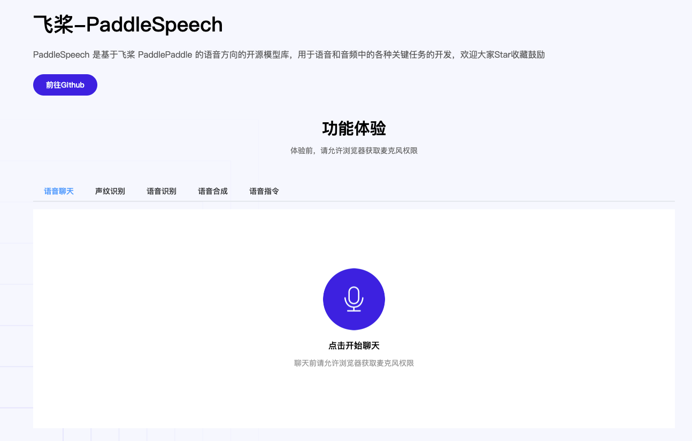

# Paddle Speech Demo

PaddleSpeechDemo 是一个以 PaddleSpeech 的语音交互功能为主体开发的 Demo 展示项目，用于帮助大家更好的上手 PaddleSpeech 以及使用 PaddleSpeech 构建自己的应用。

智能语音交互部分使用 PaddleSpeech，对话以及信息抽取部分使用 PaddleNLP，网页前端展示部分基于 Vue3 进行开发

主要功能：

`main.py` 中包含功能
+ 语音聊天：PaddleSpeech 的语音识别能力+语音合成能力，对话部分基于 PaddleNLP 的闲聊功能
+ 声纹识别：PaddleSpeech 的声纹识别功能展示
+ 语音识别：支持【实时语音识别】，【端到端识别】，【音频文件识别】三种模式
+ 语音合成：支持【流式合成】与【端到端合成】两种方式
+ 语音指令：基于 PaddleSpeech 的语音识别能力与 PaddleNLP 的信息抽取，实现交通费的智能报销

`vc.py` 中包含功能
+ 一句话合成：基于 GE2E 和 ECAPA-TDNN 模型的一句话合成方案，可以模仿输入的音频的音色进行合成任务
  + GE2E 音色克隆方案可以参考： [【FastSpeech2 + AISHELL-3 Voice Cloning】](https://github.com/PaddlePaddle/PaddleSpeech/tree/develop/examples/aishell3/vc1)
  + ECAPA-TDNN 音色克隆方案可以参考: [【FastSpeech2 + AISHELL-3 Voice Cloning (ECAPA-TDNN)
】](https://github.com/PaddlePaddle/PaddleSpeech/tree/develop/examples/aishell3/vc2)

+ 小数据微调：基于小数据集的微调方案，内置用12句话标贝中文女声微调示例，你也可以通过一键重置，录制自己的声音，注意在安静环境下录制，效果会更好，你可以

+ ENIRE-SAT：语言-语音跨模态大模型 ENIRE-SAT 可视化展示示例，支持个性化合成，跨语言语音合成（音频为中文则输入英文文本进行合成），语音编辑（修改音频文字中间的结果）功能

运行效果：

 

## 安装

### 后端环境安装

Model 中如果有模型之前是已经下载过的，就不需要在下载了，引一个软链接到 `source/model` 目录下就可以了，不需要重复下载

```
# 安装环境
cd speech_server
pip install -r requirements.txt -i https://mirror.baidu.com/pypi/simple

mkdir source
cd source

# 下载 wav
wget https://paddlespeech.bj.bcebos.com/demos/speech_web/wav_vc.zip
unzip wav_vc.zip

# 下载相关模型
mkdir model
cd model

# 下载IE模型
wget https://bj.bcebos.com/paddlenlp/applications/speech-cmd-analysis/finetune/model_state.pdparams


# 如果不需要 vc.py 的相关功能，可以跳过下面这些模型
# 下载 GE2E 相关模型
wget https://bj.bcebos.com/paddlespeech/Parakeet/released_models/ge2e/ge2e_ckpt_0.3.zip
unzip ge2e_ckpt_0.3.zip
wget https://paddlespeech.bj.bcebos.com/Parakeet/released_models/pwgan/pwg_aishell3_ckpt_0.5.zip
unzip pwg_aishell3_ckpt_0.5.zip
wget https://paddlespeech.bj.bcebos.com/Parakeet/released_models/fastspeech2/fastspeech2_nosil_aishell3_vc1_ckpt_0.5.zip
unzip fastspeech2_nosil_aishell3_vc1_ckpt_0.5.zip

# 下载 TDNN 相关模型
wget https://paddlespeech.bj.bcebos.com/Parakeet/released_models/fastspeech2/fastspeech2_aishell3_ckpt_vc2_1.2.0.zip
unzip fastspeech2_aishell3_ckpt_vc2_1.2.0.zip

# 下载 SAT 相关模型

# aishell3
wget https://paddlespeech.bj.bcebos.com/Parakeet/released_models/ernie_sat/erniesat_aishell3_ckpt_1.2.0.zip
unzip erniesat_aishell3_ckpt_1.2.0.zip

# vctk
wget https://paddlespeech.bj.bcebos.com/Parakeet/released_models/ernie_sat/erniesat_vctk_ckpt_1.2.0.zip
unzip erniesat_vctk_ckpt_1.2.0.zip

# aishell3_vctk
wget https://paddlespeech.bj.bcebos.com/Parakeet/released_models/ernie_sat/erniesat_aishell3_vctk_ckpt_1.2.0.zip
unzip erniesat_aishell3_vctk_ckpt_1.2.0.zip

# 下载 finetune 相关模型
wget https://paddlespeech.bj.bcebos.com/Parakeet/released_models/fastspeech2/fastspeech2_aishell3_ckpt_1.1.0.zip
unzip fastspeech2_aishell3_ckpt_1.1.0.zip

# 下载声码器
wget https://paddlespeech.bj.bcebos.com/Parakeet/released_models/hifigan/hifigan_aishell3_ckpt_0.2.0.zip
unzip hifigan_aishell3_ckpt_0.2.0.zip
wget https://paddlespeech.bj.bcebos.com/Parakeet/released_models/hifigan/hifigan_vctk_ckpt_0.2.0.zip
unzip hifigan_vctk_ckpt_0.2.0.zip

```

### 配置 `vc.py` 相关环境

如果不需要启动 vc 相关功能，可以跳过下面这些步骤

#### ERNIE-SAT 环境配置

ERNIE-SAT 体验依赖于 PaddleSpeech 中和 ERNIE-SAT相关的三个 `examples` 环境的配置，先确保按照在对应路径下，测试脚本可以运行（主要是 `tools`, `download`, `source`），部分可通用，在对用的环境下生成软链接就可以

在`PaddleSpeech/demos/speech_web/speech_server` 路径下，生成 tools 和 download ，可以参考 `examples/aishell3/ernie_sat`中的 `README.md` , 如果你之前已经下载过了，可以使用软链接

准备 `tools`文件夹:

```shell
mkdir -p tools/aligner
cd tools
# download MFA
wget https://github.com/MontrealCorpusTools/Montreal-Forced-Aligner/releases/download/v1.0.1/montreal-forced-aligner_linux.tar.gz
# extract MFA
tar xvf montreal-forced-aligner_linux.tar.gz
# fix .so of MFA
cd montreal-forced-aligner/lib
ln -snf libpython3.6m.so.1.0 libpython3.6m.so
cd -
# download align models and dicts
cd aligner
wget https://paddlespeech.bj.bcebos.com/MFA/ernie_sat/aishell3_model.zip
wget https://paddlespeech.bj.bcebos.com/MFA/AISHELL-3/with_tone/simple.lexicon
wget https://paddlespeech.bj.bcebos.com/MFA/ernie_sat/vctk_model.zip
wget https://paddlespeech.bj.bcebos.com/MFA/LJSpeech-1.1/cmudict-0.7b
cd ../../
```

准备 `download` 文件夹

```bash
mkdir download
cd download
wget https://paddlespeech.bj.bcebos.com/Parakeet/released_models/fastspeech2/fastspeech2_conformer_baker_ckpt_0.5.zip
wget https://paddlespeech.bj.bcebos.com/Parakeet/released_models/fastspeech2/fastspeech2_nosil_ljspeech_ckpt_0.5.zip
unzip fastspeech2_conformer_baker_ckpt_0.5.zip
unzip fastspeech2_nosil_ljspeech_ckpt_0.5.zip
cd ../
```

1. 中文 SAT 配置，参考 `examples/aishell3/ernie_sat`， 按照 `README.md` 要求配置环境，确保在路径下执行 `run.sh` 相关示例代码有效

2. 英文 SAT 配置，参考 `examples/vctk/ernie_sat`，按照 `README.md` 要求配置环境,确保在路径下执行 `run.sh` 相关示例代码有效

3. 中英文 SAT 配置，参考 `examples/aishell3_vctk/ernie_sat`，按照 `README.md` 要求配置环境,确保在路径下执行 `run.sh` 相关示例代码有效

#### finetune 环境配置

`finetune` 环境配置请参考 `examples/other/tts_finetune/tts3`，按照 `README.md` 要求配置环境,确保在路径下执行 `run.sh` 相关示例代码有效 

`finetune` 需要在 `tools/aligner` 中解压 `aishell3_model.zip`，包含`tools/aligner/aishell3_model/meta.yaml` 文件，finetune中需要使用

```bash
cd tools/aligner
unzip aishell3.zip
cd ../..
```


### 前端环境安装

前端依赖 `node.js` ，需要提前安装，确保 `npm` 可用，`npm` 测试版本 `8.3.1`，建议下载[官网](https://nodejs.org/en/)稳定版的 `node.js`

```
# 进入前端目录
cd web_client

# 安装 `yarn`，已经安装可跳过
npm install -g yarn

# 使用yarn安装前端依赖
yarn install
```

## 启动服务

### 开启后端服务

#### `main.py`
【语音聊天】【声纹识别】【语音识别】【语音合成】【语音指令】功能体验，可直接使用下面的代码
```
cd speech_server
# 默认8010端口
python main.py --port 8010
```

#### `vc.py`

【一句话合成】【小数据微调】【ENIRE-SAT】体验都依赖于MFA，体验前先确保 MFA 可用，项目tools中使用的 mfa v1 linux 版本，先确保在当前环境下 mfa 可用

```
cd speech_server
# 默认8010端口
python vc.py --port 8010
```

> 如果你是其它的系统，可以使用 conda 安装 mfa v2 进行体验，安装请参考 [Montreal Forced Aligner](https://montreal-forced-aligner.readthedocs.io/en/latest/getting_started.html)，使用 MFA v2 需要自行配置环境，并修改调用 MFA 相关的代码, mfa v1 与 mfa v2 使用上有差异

### 开启前端服务

```
cd web_client
yarn dev --port 8011
```

默认配置下，前端中配置的后台地址信息是 localhost，确保后端服务器和打开页面的游览器在同一台机器上，不在一台机器的配置方式见下方的 FAQ：【后端如果部署在其它机器或者别的端口如何修改】
## FAQ 

#### Q: 如何安装node.js

A： node.js的安装可以参考[【菜鸟教程】](https://www.runoob.com/nodejs/nodejs-install-setup.html), 确保 npm 可用

#### Q：后端如果部署在其它机器或者别的端口如何修改

A：后端的配置地址有分散在两个文件中

修改第一个文件 `PaddleSpeechWebClient/vite.config.js`

```
server: {
    host: "0.0.0.0",
    proxy: {
      "/api": {
        target: "http://localhost:8010",  // 这里改成后端所在接口
        changeOrigin: true,
        rewrite: (path) => path.replace(/^\/api/, ""),
      },
    },
  }
```

修改第二个文件 `PaddleSpeechWebClient/src/api/API.js`（ Websocket 代理配置失败，所以需要在这个文件中修改）

```
// websocket （这里改成后端所在的接口）
CHAT_SOCKET_RECORD: 'ws://localhost:8010/ws/asr/offlineStream', // ChatBot websocket 接口
ASR_SOCKET_RECORD: 'ws://localhost:8010/ws/asr/onlineStream',  // Stream ASR 接口
TTS_SOCKET_RECORD: 'ws://localhost:8010/ws/tts/online', // Stream TTS 接口
```

#### Q：后端以IP地址的形式，前端无法录音

A：这里主要是游览器安全策略的限制，需要配置游览器后重启。游览器修改配置可参考[使用js-audio-recorder报浏览器不支持getUserMedia](https://blog.csdn.net/YRY_LIKE_YOU/article/details/113745273)

chrome设置地址: chrome://flags/#unsafely-treat-insecure-origin-as-secure

## 参考资料

vue实现录音参考资料：https://blog.csdn.net/qq_41619796/article/details/107865602#t1

前端流式播放音频参考仓库：

https://github.com/AnthumChris/fetch-stream-audio

https://bm.enthuses.me/buffered.php?bref=6677
