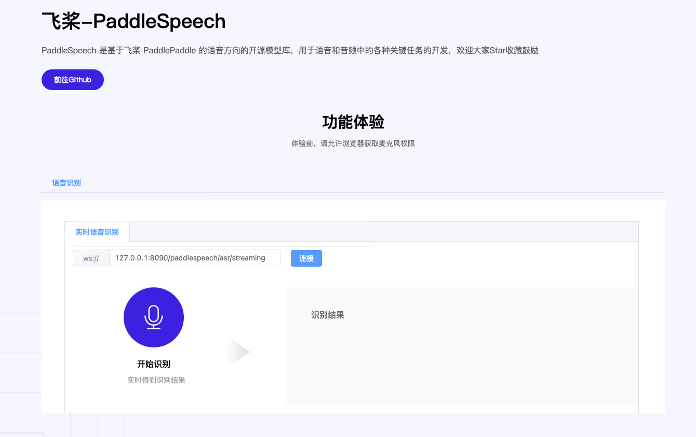

# paddlespeech serving 网页Demo



step1: 开启流式语音识别服务器端

```
# 开启流式语音识别服务
cd PaddleSpeech/demos/streaming_asr_server
paddlespeech_server start --config_file conf/ws_conformer_wenetspeech_application_faster.yaml
```

step2: 谷歌游览器打开 `web`目录下`index.html`

step3: 点击`连接`，验证WebSocket是否成功连接

step4：点击开始录音(弹窗询问，允许录音)


 
