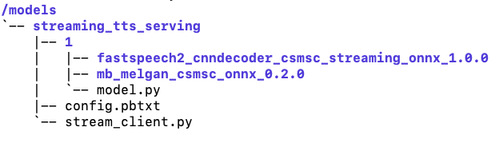

([简体中文](./README_cn.md)|English)

# Streaming Speech Synthesis Service

## Introduction
This demo is an implementation of starting the streaming speech synthesis service and accessing the service.

`Server` must be started in the docker, while `Client` does not have to be in the docker.

**The streaming_tts_serving under the path of this article ($PWD) contains the configuration and code of the model, which needs to be mapped to the docker for use.**

## Usage
### 1. Server
#### 1.1 Docker

```bash
docker pull registry.baidubce.com/paddlepaddle/fastdeploy_serving_cpu_only:22.09
docker run -dit  --net=host --name fastdeploy --shm-size="1g" -v $PWD:/models registry.baidubce.com/paddlepaddle/fastdeploy_serving_cpu_only:22.09
docker exec -it -u root fastdeploy bash
```

#### 1.2 Installation(inside the docker)
```bash
apt-get install build-essential python3-dev libssl-dev libffi-dev libxml2 libxml2-dev libxslt1-dev zlib1g-dev libsndfile1 language-pack-zh-hans wget zip
pip3 install paddlespeech
export LC_ALL="zh_CN.UTF-8"
export LANG="zh_CN.UTF-8"
export LANGUAGE="zh_CN:zh:en_US:en"
```

#### 1.3 Download models(inside the docker)
```bash
cd /models/streaming_tts_serving/1
wget https://paddlespeech.bj.bcebos.com/Parakeet/released_models/fastspeech2/fastspeech2_cnndecoder_csmsc_streaming_onnx_1.0.0.zip
wget https://paddlespeech.bj.bcebos.com/Parakeet/released_models/mb_melgan/mb_melgan_csmsc_onnx_0.2.0.zip
unzip fastspeech2_cnndecoder_csmsc_streaming_onnx_1.0.0.zip
unzip mb_melgan_csmsc_onnx_0.2.0.zip
```
**For the convenience of users, we recommend that you use the command `docker -v` to map $PWD (streaming_tts_service and the configuration and code of the model contained therein) to the docker path `/models`. You can also use other methods, but regardless of which method you use, the final model directory and structure in the docker are shown in the following figure.**

<p align="center">
  
</p>

#### 1.4 Start the server(inside the docker)

```bash
fastdeployserver --model-repository=/models --model-control-mode=explicit --load-model=streaming_tts_serving
```
Arguments:
  - `model-repository`(required): Path of model storage.
  - `model-control-mode`(required): The mode of loading the model. At present, you can use 'explicit'.
  - `load-model`(required): Name of the model to be loaded.
  - `http-port`(optional): Port for http service. Default: `8000`. This is not used in our example.
  - `grpc-port`(optional): Port for grpc service. Default: `8001`.
  - `metrics-port`(optional): Port for metrics service. Default: `8002`. This is not used in our example.

### 2. Client
#### 2.1 Installation
```bash
pip3 install tritonclient[all]
```

#### 2.2 Send request
```bash
python3 /models/streaming_tts_serving/stream_client.py
```
