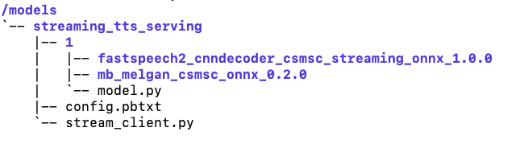

(简体中文|[English](./README.md))

# 流式语音合成服务

## 介绍

本文介绍了使用FastDeploy搭建流式语音合成服务的方法。

`服务端`必须在docker内启动,而`客户端`不是必须在docker容器内.

**本文所在路径`($PWD)下的streaming_tts_serving里包含模型的配置和代码`(服务端会加载模型和代码以启动服务),需要将其映射到docker中使用。**

## 使用
### 1. 服务端
#### 1.1 Docker
```bash
docker pull registry.baidubce.com/paddlepaddle/fastdeploy_serving_cpu_only:22.09
docker run -dit  --net=host --name fastdeploy --shm-size="1g" -v $PWD:/models registry.baidubce.com/paddlepaddle/fastdeploy_serving_cpu_only:22.09
docker exec -it -u root fastdeploy bash
```

#### 1.2 安装(在docker内)
```bash
apt-get install build-essential python3-dev libssl-dev libffi-dev libxml2 libxml2-dev libxslt1-dev zlib1g-dev libsndfile1 language-pack-zh-hans wget zip
pip3 install paddlespeech
export LC_ALL="zh_CN.UTF-8"
export LANG="zh_CN.UTF-8"
export LANGUAGE="zh_CN:zh:en_US:en"
```

#### 1.3 下载模型(在docker内)
```bash
cd /models/streaming_tts_serving/1
wget https://paddlespeech.bj.bcebos.com/Parakeet/released_models/fastspeech2/fastspeech2_cnndecoder_csmsc_streaming_onnx_1.0.0.zip
wget https://paddlespeech.bj.bcebos.com/Parakeet/released_models/mb_melgan/mb_melgan_csmsc_onnx_0.2.0.zip
unzip fastspeech2_cnndecoder_csmsc_streaming_onnx_1.0.0.zip
unzip mb_melgan_csmsc_onnx_0.2.0.zip
```
**为了方便用户使用，我们推荐用户使用1.1中的`docker -v`命令将`$PWD(streaming_tts_serving及里面包含的模型的配置和代码)映射到了docker内的/models路径`,用户也可以使用其他办法,但无论使用哪种方法,最终在docker内的模型目录及结构如下图所示。**

<p align="center">
  
</p>

#### 1.4 启动服务端(在docker内)
```bash
fastdeployserver --model-repository=/models --model-control-mode=explicit --load-model=streaming_tts_serving
```

参数:
  - `model-repository`(required): 整套模型streaming_tts_serving存放的路径.
  - `model-control-mode`(required): 模型加载的方式,现阶段, 使用'explicit'即可.
  - `load-model`(required): 需要加载的模型的名称.
  - `http-port`(optional): HTTP服务的端口号. 默认: `8000`. 本示例中未使用该端口.
  - `grpc-port`(optional): GRPC服务的端口号. 默认: `8001`.
  - `metrics-port`(optional): 服务端指标的端口号. 默认: `8002`. 本示例中未使用该端口.

### 2. 客户端
#### 2.1 安装
```bash
pip3 install tritonclient[all]
```

#### 2.2 发送请求
```bash
python3 /models/streaming_tts_serving/stream_client.py
```
