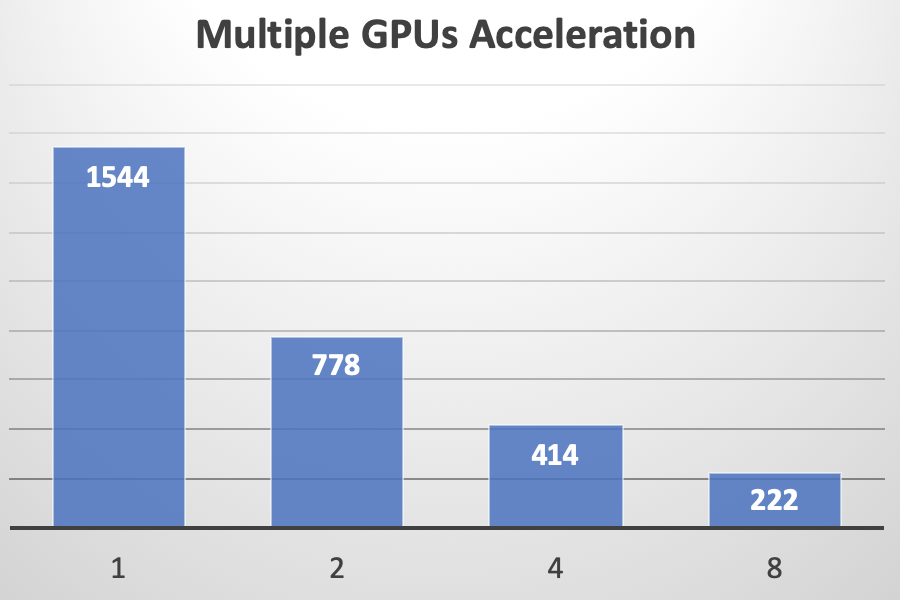

# Benchmarks

## Acceleration with Multi-GPUs

We compare the training time with 1, 2, 4, 8 Tesla V100 GPUs (with a subset of LibriSpeech samples whose audio durations are between 6.0 and 7.0 seconds).  And it shows that a **near-linear** acceleration with multiple GPUs has been achieved. In the following figure, the time (in seconds) cost for training is printed on the blue bars.

| # of GPU  | Acceleration Rate |
| --------  | --------------:   |
| 1         | 1.00 X |
| 2         | 1.98 X |
| 4         | 3.73 X |
| 8         | 6.95 X |

`utils/profile.sh` provides such a demo profiling tool, you can change it as need.

