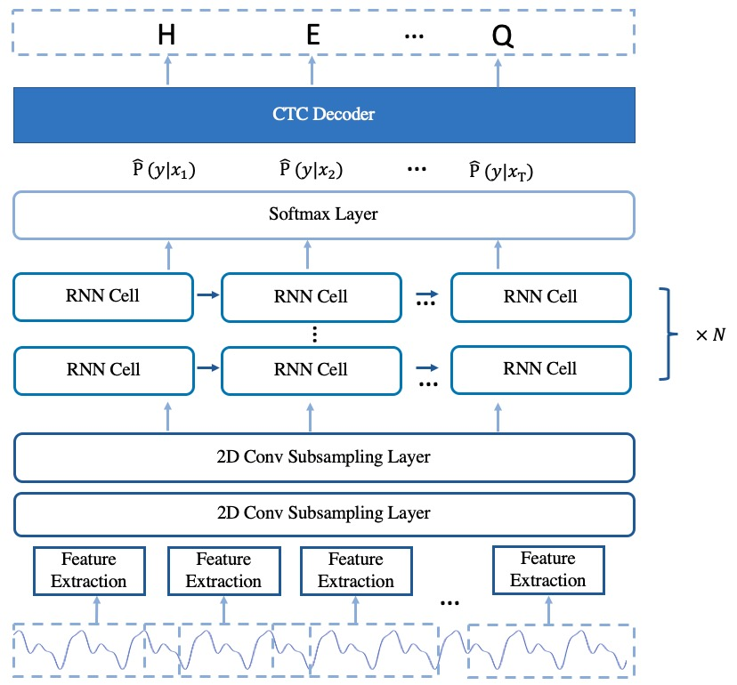

# Model Arcitecture

The implemented arcitecure of Deepspeech2 online model is based on [Deepspeech2 model](https://arxiv.org/pdf/1512.02595.pdf) with some changes. 
The model is mainly composed of 2D convolution subsampling layer and stacked single direction rnn layers. 

To illustrate the model implementation clearly, 3 parts are described in detail.  
- Data Preparation
- Backbone
- Decoder


The arcitecture of the model is shown in Fig.1. 

<p align="center">
 
<br/>Fig.1 The Arcitecture of deepspeech2 online model
</p>

## Data Preparation
### Vocabulary
For English data, the vocabulary dictionary is composed of 26 English characters with \<blank\> and \<eos\>. The \<blank\> represents the blank label in CTC, the <eos> represents the start and the end of the label. For mandarin, the vocabulary dictionary is composed of chinese characters statisticed from the training set and three additional characters, which are \<blank\>, \<unk\> and \<eos\>. The \<unk\> represents the unknown characters. 

### CMVN
For CMVN, a subset of traininig set is chosed and be used to caculate the mean and std value of the raw audio. 
 
### Feature Extraction
 For feature extraction, three methods are implemented, which are linear (FFT without using filter bank), fbank and mfcc.
 Currently, the released deepspeech2 online model use the linear feature extraction method.
 <!--
For a single utterance $x^i$ sampled from the training set $S$,
 $ S= {(x^1,y^1),(x^2,y^2),...,(x^m,y^m)}$, where $y^i$ is the label correspodding to the ${x^i}
-->
## Backbone
The Backbone is composed of two 2D convolution subsampling layers and a number of stacked single direction rnn layers. The 2D convolution subsampling layers extract feature represention from the raw audio feature and reduce the length of audio feature at the same time. After passing through the convolution subsampling layers, then the feature represention are input into the stacked rnn layers. For rnn layers, LSTM cell and GRU cell are provided.

## Decoder
To got the possibilities of characters of each frame, the feature represention of each frame output from the stacked rnn layers are then input into the dense layer to do projection. The output dim of dense layer is same with the vocabulary size. After projection, the softmax function is used to make frame-level feature representation be the possibilities of characters. While making model inference, the character possibilities of each frame are input into the CTC decoder to get the final speech recognition results.

# Training Process
```
 cd example/aishell/s0
 bash run.sh --stage 0 --stop_stage 2
```
By using the command above, the training process can be started. There are 5 stages in run.sh, and the first 3 stages are used for training process. The stage 0 is used for data preparation, in which the dataset will be downloaded, and the manifest files of dataset, vocabulary dictionary and CMVN file will be generated in "./data/". The stage 1 is used for training the model, the log file and model checkpoint is saved in "exp/deepspeech2_online/". The stage 2 is used to generated final model for predicting by averaging the top k model parameters.  
 
# Testing Process
 ```
 bash run.sh --stage 3 --stop_stage 5
```
After the training process, we use stage 3,4,5 for testing process. The stage 3 test the model generated by the stage 2 and provided the CER index of the test set. The stage 4 transform the model from dynamic graph to static graph by using "jit". The stage 5 test the model in static graph.
