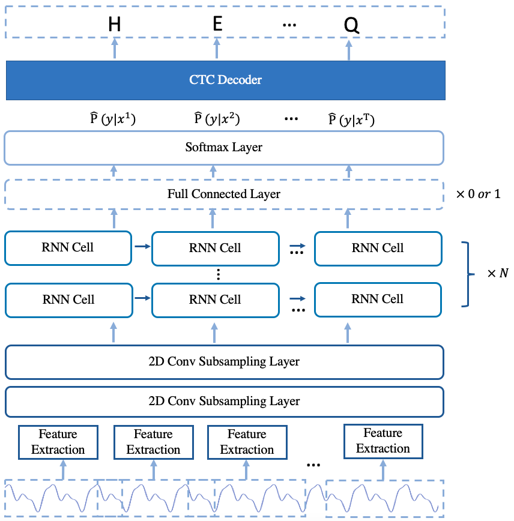

# Model Arcitecture

 The implemented arcitecure of Deepspeech2 online model is based on [Deepspeech2 model](https://arxiv.org/pdf/1512.02595.pdf) with some changes. 
 The model is mainly composed of 2D convolution subsampling layer and single direction rnn layers. 
 To illustrate the model implementation clearly, 5 parts is described in detail.  
     1. Feature Extraction.
     2. 2D Convolution subsampling layer.
     3. RNN layer with only forward direction.
     4. Softmax Layer.
     5. CTC Decoder.
The arcitecture of the model is shown in Fig.1. 

 
 Fig.1 The Arcitecture of deepspeech2 online modle

# Feature Extraction

 Three methods of feature extraction is implemented, which are linear, fbank and mfcc.
 For a single utterance $x^i$ sampled from the training set $S$,
 $ S= {(x^1,y^1),(x^2,y^2),...,(x^m,y^m)}$, where $y^i$ is the label correspodding to the ${x^i}

# Backbone
The Backbone is composed of 2D Convolution subsampling layer.
