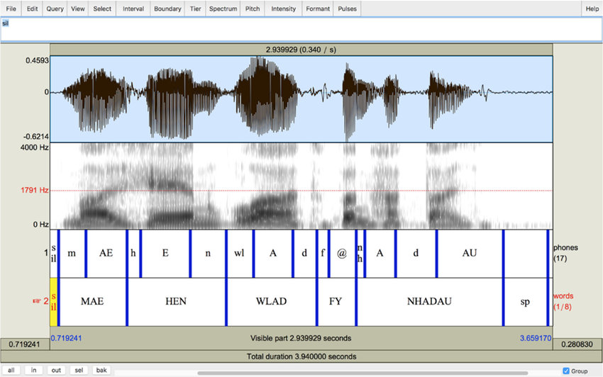

# Praat and TextGrid

* [**Praat: doing phonetics by computer**](https://www.fon.hum.uva.nl/praat/)
* [TextGrid](https://github.com/kylebgorman/textgrid)

## Praat

**Praat语音学软件**，原名**Praat: doing phonetics by computer**，通常简称**Praat**，是一款[跨平台](https://zh.wikipedia.org/wiki/跨平台)的多功能[语音学](https://zh.wikipedia.org/wiki/语音学)专业[软件](https://zh.wikipedia.org/wiki/软件)，主要用于对[数字化](https://zh.wikipedia.org/wiki/数字化)的[语音](https://zh.wikipedia.org/wiki/语音)[信号](https://zh.wikipedia.org/wiki/信号)进行[分析](https://zh.wikipedia.org/w/index.php?title=语音分析&action=edit&redlink=1)、标注、[处理](https://zh.wikipedia.org/wiki/数字信号处理)及[合成](https://zh.wikipedia.org/wiki/语音合成)等实验，同时生成各种[语图](https://zh.wikipedia.org/w/index.php?title=语图&action=edit&redlink=1)和文字报表。





## TextGrid

### TextGrid文件结构

```text
第一行是固定的:File type = "ooTextFile"
第二行也是固定的:Object class = "TextGrid"
空一行
xmin = xxxx.xxxx  # 表示开始时间
xmax = xxxx.xxxx  # 表示结束时间
tiers? <exists>  # 这一行固定
size = 4  # 表示这个文件有几个item, item也叫tiers, 可以翻译为'层', 这个值是几,就表示有几个item
item []:
    item [1]:
        class = "IntervalTier"
        name = "phone"
        xmin = 1358.8925
        xmax = 1422.5525
        intervals: size = 104
        intervals [1]:
            xmin = 1358.8925
            xmax = 1361.8925
            text = "sil"
        intervals [2]:
            xmin = 1361.8925
            xmax = 1362.0125
            text = "R"
        intervals [3]:
            ...
        intervals [104]:
            xmin = 1422.2325
            xmax = 1422.5525
            text = "sil"
    item [2]:
        class = "IntervalTier"
        name = "word"
        xmin = 1358.8925
        xmax = 1422.5525
        intervals: size = 3
        intervals [1]:
            xmin = 1358.8925
            xmax = 1361.8925
            text = "sp"
```

textgrid 文件中的 size 的值是几就表示有几个 item， 每个 item 下面包含 class, name, xmin, xmax, intervals 的键值对，item 中的 intervals: size 是几就表示这个 item 中有几个 intervals，每个 intervals 有 xmin, xmax, text 三个键值参数。所有 item 中的 xmax - xmin 的值是一样的。

### 安装

```python
pip3 install textgrid
```

### 使用

1. 读一个textgrid文件

   ```python
   import textgrid
   tg = textgrid.TextGrid()
   tg.read('file.TextGrid')  # 'file.TextGrid' 是文件名
   ```

   tg.tiers属性:
   会把文件中的所有item打印出来, print(tg.tiers) 的结果如下:

   ```text
   [IntervalTier(
       phone, [
           Interval(1358.89250, 1361.89250, sil),
           Interval(1361.89250, 1362.01250, R),
           Interval(1362.01250, 1362.13250, AY1),
           Interval(1362.13250, 1362.16250, T),

   ...
           ]
       )
   ]
   ```

   此外, tg.tiers[0] 表示第一个 IntervalTier, 支持继续用中括号取序列, '.'来取属性.
   比如:

   ```text
   tg.tiers[0][0].mark   -->    'sil'
   tg.tiers[0].name    -->     'phone'
   tg.tiers[0][0].minTime  -->   1358.8925
   tg.tiers[0].intervals  -->   [Interval(1358.89250, 1361.89250, sil), ..., Interval(1422.23250, 1422.55250, sil)]
   tg.tiers[0].maxTime  --> 1422.55250
   ```

   TextGrid 模块中包含四种对象

   ```
   PointTier 可以理解为标记（点）的集合
   IntervalTier 可以理解为时长（区间）的集合
   Point    可以理解为标记
   Interval  可以理解为时长
   ```


2. textgrid库中的对象
   **IntervalTier** 对象:
   方法

   ```
   add(minTime, maxTime, mark): 添加一个标记,需要同时传入起止时间, 和mark的名字.
   addInterval(interval): 添加一个Interval对象, 该Interval对象中已经封装了起止时间.
   remove(minTime, maxTime, mark): 删除一个Interval
   removeInterval(interval): 删除一个Interval
   indexContaining(time): 传入时间或Point对象, 返回包含该时间的Interval对象的下标
   例如:
     print(tg[0].indexContaining(1362))   --> 1
     表示tg[0] 中包含1362时间点的是 下标为1的 Interval 对象
     intervalContaining(): 传入时间或Point对象, 返回包含该时间的Interval对象
   例如
   	print(tg[0].intervalContaining(1362))  -->  Interval(1361.89250, 1362.01250, R)
   read(f): f是文件对象, 读一个TextGrid文件
   write(f): f是文件对象, 写一个TextGrid文件
   fromFile(f_path): f_path是文件路径, 从一个文件读
   bounds():  返回一个元组, (minTime, maxTime)
   ```


   属性

   ```
   intervals  --> 返回所有的 interval 的列表
   maxTime   -->  返回 number(decimal.Decimal)类型, 表示结束时间
   minTime  -->  返回 number(decimal.Decimal)类型, 表示开始时间
   name     -->  返回字符串
   strict  -- > 返回bool值, 表示是否严格TextGrid格式
   ```

   ​  

   **PointTier** 对象:
   方法

   ```
   add(minTime, maxTime, mark): 添加一个标记,需要同时传入起止时间, 和mark的名字.
   addPoint(point): 添加一个Point对象, 该Point对象中已经封装了起止时间.
   remove(time, mark): 删除一个 point, 传入时间和mark
   removePoint(point): 删除一个 point, 传入point对象
   read(f):  读, f是文件对象
   write(f): 写, f是文件对象
   fromFile(f_path): f_path是文件路径, 从一个文件读
   bounds():  返回一个元组, (minTime, maxTime)
   ```


   属性

   ```
   points  返回所有的 point 的列表
   maxTime 和IntervalTier一样, 返回结束时间
   minTime 和IntervalTier一样, 返回开始时间
   name    返回name
   ```


   **Point** 对象:
       支持比较大小, 支持加减运算
   属性:

   ```
   mark:
   time:
   ```

   ​  

   **Interval** 对象:
       支持比较大小, 支持加减运算
       支持 in, not in 的运算
   方法:

   ```
   duration(): 返回number 类型, 表示这个Interval的持续时间
   bounds(): -->   返回元组, (minTime, maxTime)
   overlaps(Interval):  --> 返回bool值, 判断本Interval的时间和传入的的Interval的时间是否重叠, 是返回True
   ```

   属性:

   ```
   mark
   maxTime
   minTime
   strick:  --> 返回bool值, 判断格式是否严格的TextGrid格式
   ```

    **TextGrid** 对象:
       支持列表的取值,复制, 迭代, 求长度, append, extend, pop方法
   方法:

   ```
   getFirst(tierName)  返回第一个名字为tierName的tier
   getList(tierName)   返回名字为tierName的tier的列表
   getNames()          返回所有tier的名字的列表
   append(tier)        添加一个tier作为其中的元素
   extend(tiers)       添加多个tier作为其中的元素
   pop(tier)           删除一个tier
   read(f)             f是文件对象
   write(f)            f是文件对象
   fromFile(f_path)    f_path是文件路径
   ```

   属性：

   ```
   maxTime
   minTime
   name
   strict
   tiers               返回所有tiers的列表
   ```

   **MLF** 对象
       MLF('xxx.mlf')
           'xxx.mlf'为mlf格式的文件,
           读取hvite-o sm生成的htk.mlf文件并将其转换为 TextGrid的列表
   方法:

   ```
   read(f)  f是文件对象
   write(prefix='')  prefix是写出路径的前缀,可选
   ```

   属性:

   ```
   grids:  --> 返回读取的grids的列表
   ```


## Reference

* https://zh.wikipedia.org/wiki/Praat%E8%AF%AD%E9%9F%B3%E5%AD%A6%E8%BD%AF%E4%BB%B6
* https://blog.csdn.net/duxin_csdn/article/details/88966295
