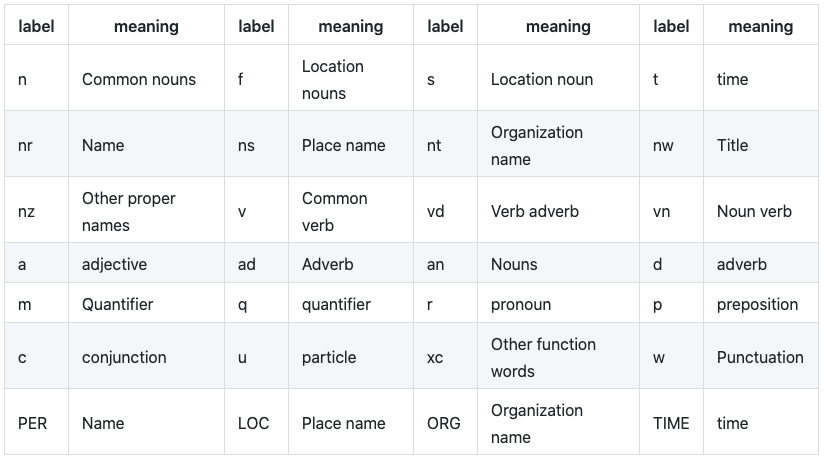
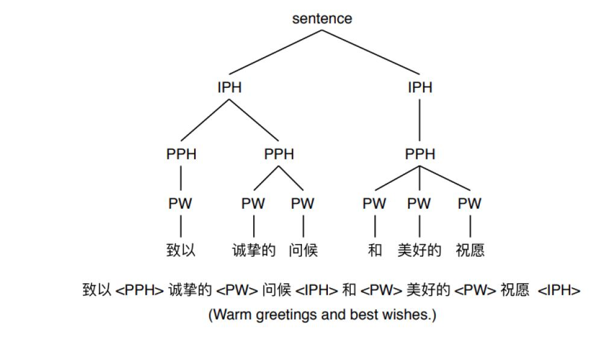

# Text Front End


## Text Segmentation

There are various libraries including some of the most popular ones like NLTK, Spacy, Stanford CoreNLP that that provide excellent, easy to use functions for sentence segmentation.

* https://github.com/bminixhofer/nnsplit
* [DeepSegment](https://github.com/notAI-tech/deepsegment)  [blog](http://bpraneeth.com/projects/deepsegment) [1](https://praneethbedapudi.medium.com/deepcorrection-1-sentence-segmentation-of-unpunctuated-text-a1dbc0db4e98) [2](https://praneethbedapudi.medium.com/deepcorrection2-automatic-punctuation-restoration-ac4a837d92d9) [3](https://praneethbedapudi.medium.com/deepcorrection-3-spell-correction-and-simple-grammar-correction-d033a52bc11d)  [4](https://praneethbedapudi.medium.com/deepsegment-2-0-multilingual-text-segmentation-with-vector-alignment-fd76ce62194f)


## Text Normalization(文本正则)

The **basic preprocessing steps** that occur in English NLP, including data cleaning, stemming/lemmatization, tokenization and stop words.  **not all of these steps are necessary for Chinese text data!**  

### Lexicon Normalization

There’s a concept similar to stems in this language, and they’re called Radicals. **Radicals are basically the building blocks of Chinese characters.** All Chinese characters are made up of a finite number of components which are put together in different orders and combinations. Radicals are usually the leftmost part of the character. There are around 200 radicals in Chinese, and they are used to index and categorize characters.  

Therefore, procedures like stemming and lemmatization are not useful for Chinese text data because seperating the radicals would **change the word’s meaning entirely**.  

### Tokenization

**Tokenizing breaks up text data into shorter pre-set strings**, which help build context and meaning for the machine learning model.   

These “tags” label the part of speech. There are 24 part of speech tags and 4 proper name category labels in the `**jieba**` package’s existing dictionary.



### Stop Words

In NLP, **stop words are “meaningless” words** that make the data too noisy or ambiguous. 

Instead of manually removing them, you could import the `**stopwordsiso**` package for a full list of Chinese stop words. More information can be found [here](https://pypi.org/project/stopwordsiso/). And with this, we can easily create code to filter out any stop words in large text data.

```python
!pip install stopwordsiso
import stopwordsiso
from stopwordsiso import stopwords
stopwords(["zh"])  # Chinese
```


文本正则化 文本正则化主要是讲非标准词(NSW)进行转化，比如：  

1. 数字、电话号码:  10086 -> 一千零八十六/幺零零八六  
2. 时间，比分:  23:20 -> 二十三点二十分/二十三比二十  
3. 分数、小数、百分比:  3/4 -> 四分之三，3.24 -> 三点一四， 15% -> 百分之十五  
4. 符号、单位:  ￥ -> 元， kg -> 千克  
5. 网址、文件后缀:  www. -> 三W点  

其他转换：

1. 简体和繁体转换：中国语言 -> 中國語言
2. 半角和全角准换：,  -> ，

### tools

* https://github.com/google/re2

* https://github.com/speechio/chinese_text_normalization

* [vinorm](https://github.com/NoahDrisort/vinorm) [cpp_verion](https://github.com/NoahDrisort/vinorm_cpp_version)

  Python package for text normalization, use for frontend of Text-to-speech Reseach

* https://github.com/candlewill/CNTN

  This is a ChiNese Text Normalization (CNTN) tool for Text-to-speech system, which is based on [sparrowhawk](https://github.com/google/sparrowhawk).

* [Simplified and Traditional Chinese Characters converter](https://github.com/berniey/hanziconv)

* [Halfwidth and Fullwidth](https://zh.wikipedia.org/wiki/%E5%85%A8%E5%BD%A2%E5%92%8C%E5%8D%8A%E5%BD%A2)

* https://github.com/BYVoid/OpenCC


## Word Segmentation(分词)

分词之所以重要可以通过这个例子来说明:  
广州市长隆马戏欢迎你 -> 广州市 长隆 马戏 欢迎你  
如果没有分词错误会导致句意完全不正确:  
广州 市长 隆马戏 欢迎你  

分词常用方法分为最大前向匹配(基于字典)和基于CRF的分词方法。用CRF的方法相当于是把这个任务转换成了序列标注，相比于基于字典的方法好处是对于歧义或者未登录词有较强的识别能力，缺点是不能快速fix bug，并且性能略低于词典。


中文分词的常见工具:
* https://github.com/lancopku/PKUSeg-python
* https://github.com/thunlp/THULAC-Python
* https://github.com/fxsjy/jieba
* CRF++
* https://github.com/isnowfy/snownlp

### MMSEG
* [MMSEG: A Word Identification System for Mandarin Chinese Text Based on Two Variants of the Maximum Matching Algorithm](http://technology.chtsai.org/mmseg/)
* [`中文分词`简单高效的MMSeg](https://www.cnblogs.com/en-heng/p/5872308.html)
* [mmseg分词算法及实现](https://blog.csdn.net/daniel_ustc/article/details/50488040)
* [Mmseg算法](https://www.jianshu.com/p/e4ae8d194487)
* [浅谈中文分词](http://www.isnowfy.com/introduction-to-chinese-segmentation/)

* [pymmseg-cpp](https://github.com/pluskid/pymmseg-cpp.git)
* [ustcdane/mmseg](https://github.com/ustcdane/mmseg)
* [jkom-cloud/mmseg](https://github.com/jkom-cloud/mmseg)


### CScanner
* [CScanner - A Chinese Lexical Scanner](http://technology.chtsai.org/cscanner/)


## Part of Speech(词性预测)

词性解释

```
n/名词 np/人名 ns/地名 ni/机构名 nz/其它专名
m/数词 q/量词 mq/数量词 t/时间词 f/方位词 s/处所词
v/动词 a/形容词 d/副词 h/前接成分 k/后接成分
i/习语 j/简称 r/代词 c/连词 p/介词 u/助词 y/语气助词
e/叹词 o/拟声词 g/语素 w/标点 x/其它
```


## G2P(注音)

注音是需要将词转换成对应的发音，对于中文是将其转换成拼音，比如 绿色->(lv4 se4) 这里的数字表示声调。

传统方法是使用字典，但是对于未登录词就很难解决。基于模型的方法是使用 [Phonetisaurus](https://github.com/AdolfVonKleist/Phonetisaurus)。 论文可以参考 - WFST-based Grapheme-to-Phoneme Conversion: Open Source Tools for Alignment, Model-Building and Decoding

当然这个问题也可以看做是序列标注用CRF或者基于神经网络的模型都可以做。 基于神经网络工具:

*  https://github.com/kakaobrain/g2pM
* https://github.com/Kyubyong/g2p


## Prosody(韵律预测)

ToBI(an abbreviation of tones and break indices) is a set of conventions for transcribing and annotating the prosody of speech. 中文主要关注break。

韵律等级结构:  

```
音素 -> 音节 -> 韵律词(Prosody Word, PW) -> 韵律短语(prosody phrase, PPH) -> 语调短句(intonational phrase, IPH) -> 子句子 -> 主句子 -> 段落 -> 篇章  
LP -> LO -> L1(#1) -> L2(#2) -> L3(#3) -> L4(#4) -> L5 -> L6 -> L7  
```


主要关注 PW, PPH, IPH  

|     |  停顿时长   | 前后音高特征 |
| --- | ----------| --- |
| 韵律词边界 | 不停顿或从听感上察觉不到停顿 | 无 |
| 韵律短语边界 | 可以感知停顿，但无明显的静音段 | 音高不下倾或稍下倾，韵末不可做句末 |
| 语调短语边界 | 有较长停顿 | 音高下倾比较完全，韵末可以作为句末 |

常用方法使用的是级联CRF，首先预测如果是PW，再继续预测是否是PPH，再预测是否是IPH



论文: 2015 .Ding Et al. - Automatic Prosody Prediction For Chinese Speech Synthesis Using BLSTM-RNN and Embedding Features


## Polyphone(多音字)


## Linguistic Features(语言学特征)


## 基于神经网络的前端文本分析模型

最近这两年基本都是基于 BERT，所以这里记录一下相关的论文:

- g2p: 2019. Sevinj Et al. Transformer based Grapheme-to-Phoneme Conversion
- 分词: 2019 huang Et al. - Toward Fast and Accurate Neural Chinese Word Segmentation with Multi-Criteria Learning
- 韵律: 2020 Zhang Et al. - Chinese Prosodic Structure Prediction Based on a Pretrained Language Representation Model

除此之外，BLSTM + CRF 也比较主流。


## 总结

总结一下，文本分析各个模块的方法:

TN: 基于规则的方法

分词: 字典/CRF/BLSTM+CRF/BERT

注音: ngram/CRF/BLSTM/seq2seq

韵律: CRF/BLSTM + CRF/ BERT


考虑到分词，注音，韵律都是基于序列标注任务，所以理论上来说可以通过一个模型搞定。


## Reference
* [Text Front End](https://slyne.github.io/%E5%85%AC%E5%BC%80%E8%AF%BE/2020/10/03/TTS1/)
* [Chinese Natural Language (Pre)processing: An Introduction](https://towardsdatascience.com/chinese-natural-language-pre-processing-an-introduction-995d16c2705f)
* [Beginner’s Guide to Sentiment Analysis for Simplified Chinese using SnowNLP](https://towardsdatascience.com/beginners-guide-to-sentiment-analysis-for-simplified-chinese-using-snownlp-ce88a8407efb)