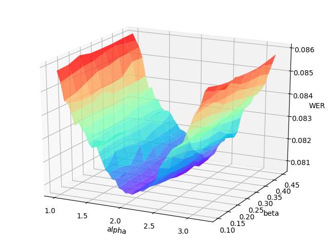

# Getting Started

Several shell scripts provided in `./examples/tiny/local` will help us to quickly give it a try, for most major modules, including data preparation, model training, case inference and model evaluation, with a few public dataset (e.g. [LibriSpeech](http://www.openslr.org/12/), [Aishell](http://www.openslr.org/33)). Reading these examples will also help you to understand how to make it work with your own data.

Some of the scripts in `./examples` are not configured with GPUs. If you want to train with 8 GPUs, please modify `CUDA_VISIBLE_DEVICES=0,1,2,3,4,5,6,7`. If you don't have any GPU available, please set `CUDA_VISIBLE_DEVICES=` to use CPUs instead. Besides, if out-of-memory problem occurs, just reduce `batch_size` to fit.

Let's take a tiny sampled subset of [LibriSpeech dataset](http://www.openslr.org/12/) for instance.

- Go to directory

    ```bash
    cd examples/tiny
    ```

    Notice that this is only a toy example with a tiny sampled subset of LibriSpeech. If you would like to try with the complete dataset (would take several days for training), please go to `examples/librispeech` instead.

- Source env

    ```bash
    source path.sh
    ```
    **Must do this before starting do anything.**
    Set `MAIN_ROOT` as project dir. Using defualt `deepspeech2` model as default, you can change this in the script.

- Main entrypoint

    ```bash
    bash run.sh
    ```
    This just a demo, please make sure every `step` is work fine when do next `step`.

More detailed information are provided in the following sections. Wish you a happy journey with the *DeepSpeech on PaddlePaddle* ASR engine!

## Training a model

The key steps of training for Mandarin language are same to that of English language and we have also provided an example for Mandarin training with Aishell in ```examples/aishell/local```. As mentioned above, please execute ```sh data.sh```, ```sh train.sh```, ```sh test.sh``` and ```sh infer.sh``` to do data preparation, training, testing and inference correspondingly. We have also prepared a pre-trained model (downloaded by local/download_model.sh) for users to try with ```sh infer_golden.sh``` and ```sh test_golden.sh```. Notice that, different from English LM, the Mandarin LM is character-based and please run ```local/tune.sh``` to find an optimal setting.

## Speech-to-text Inference

An inference module caller `infer.py` is provided to infer, decode and visualize speech-to-text results for several given audio clips. It might help to have an intuitive and qualitative evaluation of the ASR model's performance.

```bash
CUDA_VISIBLE_DEVICES=0 bash local/infer.sh
```

We provide two types of CTC decoders: *CTC greedy decoder* and *CTC beam search decoder*. The *CTC greedy decoder* is an implementation of the simple best-path decoding algorithm, selecting at each timestep the most likely token, thus being greedy and locally optimal. The [*CTC beam search decoder*](https://arxiv.org/abs/1408.2873) otherwise utilizes a heuristic breadth-first graph search for reaching a near global optimality; it also requires a pre-trained KenLM language model for better scoring and ranking. The decoder type can be set with argument `decoding_method`.

## Evaluate a Model

To evaluate a model's performance quantitatively, please run:

```bash
CUDA_VISIBLE_DEVICES=0 bash local/test.sh
```

The error rate (default: word error rate; can be set with `error_rate_type`) will be printed.

For more help on arguments:

## Hyper-parameters Tuning

The hyper-parameters $\alpha$ (language model weight) and $\beta$ (word insertion weight) for the [*CTC beam search decoder*](https://arxiv.org/abs/1408.2873) often have a significant impact on the decoder's performance. It would be better to re-tune them on the validation set when the acoustic model is renewed.

`tune.py` performs a 2-D grid search over the hyper-parameter $\alpha$ and $\beta$. You must provide the range of $\alpha$ and $\beta$, as well as the number of their attempts.


```bash
CUDA_VISIBLE_DEVICES=0 bash local/tune.sh
```

 The grid search will print the WER (word error rate) or CER (character error rate) at each point in the hyper-parameters space, and draw the error surface optionally. A proper hyper-parameters range should include the global minima of the error surface for WER/CER, as illustrated in the following figure.

<p align="center">

<br/>An example error surface for tuning on the dev-clean set of LibriSpeech
</p>

Usually, as the figure shows, the variation of language model weight ($\alpha$) significantly affect the performance of CTC beam search decoder. And a better procedure is to first tune on serveral data batches (the number can be specified) to find out the proper range of hyper-parameters, then change to the whole validation set to carray out an accurate tuning.

After tuning, you can reset $\alpha$ and $\beta$ in the inference and evaluation modules to see if they really help improve the ASR performance. For more help
