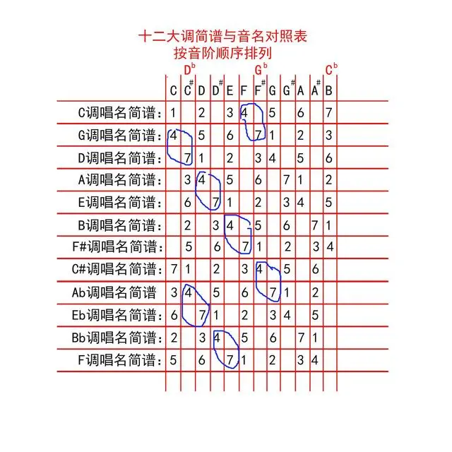

本人非音乐专业人士，如文档中有误欢迎指正。

# 一、常见基础
## 1.1 简谱和音名（note）
<p align="left">
  
</p>

上图从左往右的黑键音名分别是：C#/Db，D#/Db，F#/Db，G#/Ab，A#/Bb
钢琴88键如下图，分为大字一组，大字组，小字组，小字一组，小字二组，小字三组，小字四组。分别对应音名的后缀是 1 2 3 4 5 6，例如小字一组（C大调）包含的键分别为： C4，C#4/Db4，D4，D#4/Eb4，E4，F4，F#4/Gb4，G4，G#4/Ab4，A4，A#4/Bb4，B4  
钢琴八度音就是12345671八个音，最后一个音是高1。**遵循：全全半全全全半** 就会得到 1 2 3 4 5 6 7 (高)1 的音

<p align="left">
  
</p>

## 1.2 十二大调
“#”表示升调

<p align="left">
  
</p>

“b”表示降调

<p align="left">
  
</p>

什么大调表示Do(简谱1) 这个音从哪个键开始，例如D大调，则用D这个键来表示 Do这个音。
下图是十二大调下简谱与音名的对应表。

<p align="left">
  
</p>


## 1.3 Tempo
Tempo 用于表示速度（Speed of the beat/pulse），一分钟里面有几拍（beats per mimute BPM）

<p align="left">
  
</p>

whole note -->  4 beats</br>
half note --> 2 beats</br>
quarter note --> 1 beat</br>
eighth note --> 1/2 beat</br>
sixteenth note --> 1/4 beat</br> 


# 二、应用试验
## 2.1 从谱中获取 music scores
music scores 包含：note，note_dur，is_slur

<p align="left">
  
</p>

从左上角的谱信息 *bE* 可以得出该谱子是 **降E大调**，可以对应1.2小节十二大调简谱音名对照表根据 简谱获取对应的note
从左上角的谱信息 *quarter note* 可以得出该谱子的速度是 **一分钟95拍（beat）**，一拍的时长 = **60/95 = 0.631578s**
从左上角的谱信息 *4/4* 可以得出该谱子表示四分音符为一拍（分母的4），每小节有4拍（分子的4）

从该简谱上可以获取 music score 如下：

|text |phone |简谱（辅助）后面的点表示高八音 |note （从小字组开始算） |几拍（辅助） |note_dur |is_slur|
:-------------:| :------------:| :-----: | -----: | :-----: |:-----:| :-----:  |
|小 |x   |5  |A#3/Bb3 |半 |0.315789 |0 |
|   |iao |5  |A#3/Bb3 |半 |0.315789 |0 |
|酒 |j   |1. |D#4/Eb4 |半 |0.315789 |0 |
|   |iu  |1. |D#4/Eb4 |半 |0.315789 |0 |
|窝 |w   |2. |F4      |半 |0.315789 |0 |
|   |o   |2. |F4      |半 |0.315789 |0 |
|长 |ch  |3. |G4      |半 |0.315789 |0 |
|   |ang |3. |G4      |半 |0.315789 |0 |
|   |ang |1. |D#4/Eb4 |半 |0.315789 |1 |
|睫 |j   |1. |D#4/Eb4 |半 |0.315789 |0 |
|   |ie  |1. |D#4/Eb4 |半 |0.315789 |0 |
|   |ie  |5  |A#3/Bb3 |半 |0.315789 |1 |
|毛 |m   |5  |A#3/Bb3 |一 |0.631578 |0 |
|   |ao  |5  |A#3/Bb3 |一 |0.631578 |0 |
|是 |sh  |5  |A#3/Bb3 |半 |0.315789 |0 |
|   |i   |5  |A#3/Bb3 |半 |0.315789 |0 |
|你 |n   |3. |G4      |半 |0.315789 |0 |
|   |i   |3. |G4      |半 |0.315789 |0 |
|最 |z   |2. |F4      |半 |0.315789 |0 |
|   |ui  |2. |F4      |半 |0.315789 |0 |
|美 |m   |3. |G4      |半 |0.315789 |0 |
|   |ei  |3. |G4      |半 |0.315789 |0 |
|的 |d   |2. |F4      |半 |0.315789 |0 |
|   |e   |2. |F4      |半 |0.315789 |0 |
|记 |j   |7  |D4      |半 |0.315789 |0 |
|   |i   |7  |D4      |半 |0.315789 |0 |
|号 |h   |5  |A#3/Bb3 |半 |0.315789 |0 |
|   |ao  |5  |A#3/Bb3 |半 |0.315789 |0 |


## 2.2 一些实验

<div align = "center">
<table style="width:100%">
  <thead>
    <tr>
      <th> 序号  </th>
      <th width="500"> 说明  </th>
      <th> 合成音频（diffsinger_opencpop + pwgan_opencpop） </th>
    </tr>
  </thead>
  <tbody>
    <tr>
      <td > 1 </td>
      <td > 原始 opencpop 标注的 notes，note_durs，is_slurs，升F大调，起始在小字组（第3组） </td>
      <td align = "center">
      <a href="https://paddlespeech.bj.bcebos.com/t2s/svs/svs_music_scores/test1.wav" rel="nofollow">
            </a><br>
      </td>
    </tr>
    <tr>
      <td > 2 </td>
      <td > 原始 opencpop 标注的 notes 和 is_slurs，note_durs 改变（从谱子获取） </td>
      <td align = "center">
      <a href="https://paddlespeech.bj.bcebos.com/t2s/svs/svs_music_scores/test2.wav" rel="nofollow">
            </a><br>
      </td>
    </tr>
    <tr>
      <td > 3 </td>
      <td > 原始 opencpop 标注的 notes 去掉 rest（毛字一拍），is_slurs 和 note_durs 改变（从谱子获取） </td>
      <td align = "center">
      <a href="https://paddlespeech.bj.bcebos.com/t2s/svs/svs_music_scores/test3.wav" rel="nofollow">
            </a><br>
      </td>
    </tr>
    <tr>
      <td > 4 </td>
      <td > 从谱子获取 notes，note durs，is_slurs，不含 rest（毛字一拍），起始在小字一组（第3组） </td>
      <td align = "center">
      <a href="https://paddlespeech.bj.bcebos.com/t2s/svs/svs_music_scores/test4.wav" rel="nofollow">
            </a><br>
      </td>
    </tr>
    <tr>
      <td > 5 </td>
      <td > 从谱子获取 notes，note durs，is_slurs，加上 rest （毛字半拍，rest半拍），起始在小字一组（第3组）</td>
      <td align = "center">
      <a href="https://paddlespeech.bj.bcebos.com/t2s/svs/svs_music_scores/test5.wav" rel="nofollow">
            </a><br>
      </td>
    </tr>
    <tr>
      <td > 6 </td>
      <td > 从谱子获取 notes， is_slurs，包含 rest，note_durs 从原始标注获取，起始在小字一组（第3组） </td>
      <td align = "center">
      <a href="https://paddlespeech.bj.bcebos.com/t2s/svs/svs_music_scores/test6.wav" rel="nofollow">
            </a><br>
      </td>
    </tr>
    <tr>
      <td > 7 </td>
      <td > 从谱子获取 notes，note durs，is_slurs，不含 rest（毛字一拍），起始在小字一组（第4组） </td>
      <td align = "center">
      <a href="https://paddlespeech.bj.bcebos.com/t2s/svs/svs_music_scores/test7.wav" rel="nofollow">
            </a><br>
      </td>
    </tr>
    
  </tbody>
</table>

</div>

上述实验表明通过该方法来提取 music score 是可行的，但是在应用中可以**灵活地在歌词中加"AP"(用来表示吸气声)和"SP"(用来表示停顿声)**，对应的在 **note 上加 rest**，会使得整体的歌声合成更自然。
除此之外，还要考虑哪一个大调并且以哪一组为起始**得到的 note 在训练数据集中出现过**，如若推理时传入训练数据中没有见过的 note， 合成出来的音频可能不是我们期待的音调。

# 三、其他
## 3.1 读取midi

```python
import mido
mid = mido.MidiFile('2093.midi')
```
