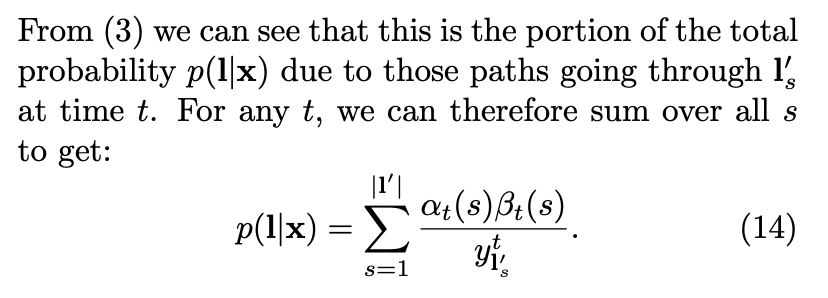

## Derivative of CTC Loss

关于CTC的介绍已经有很多不错的教程了，但是完整的描述CTCLoss的前向和反向过程的很少，而且有些公式推导省略和错误。本文主要关注CTC Loss的梯度是如何计算的，关于CTC的介绍这里不做过多赘述，具体参看文末参考。

CTC主要应用于语音和OCR中，已语音[Deepspeech2](https://arxiv.org/abs/1512.02595)模型为例，CTC的网络一般如下图所示，包含softmax和CTCLoss两部分。反向传播需要求得loss L相对于logits $u^i$​的梯度。下面先介绍CTCLoss的前向计算。

> 图片来源于文末参考

## 1. CTC Loss 的计算

CTC中path的定义与概率的计算如下：

path 是 $ L'^T$​​的元素，用 $ \pi $​​表示。 $ \textbf{x} $​​ 是输入特征，$\textbf{y}$​​ 是输出label， 都是序列。 $ L $​​ 是输出的 vocab, L‘ 是 $ L \cup {blank}$​​。 $y_{\pi_{t}}^t$​​ 表示在t时刻，$\pi_{t}$​​ label时的观察概率。其中$\pi_{t}$​​ 表示 $\pi$​​ path在t时刻的label。$\pi$​​ 是 $\textbf{y}$​​ 与 $ \textbf{x}$​​ 的一个alignment，长度是$T$​​，取值空间为$L'$​​​。path也称为alignment。

公式（2）解释了给定输入 $\textbf{x}$​ ，输出 $ \pi $​  path 的概率，即从时间t=1到T每个时间点的概率 $y_{\pi_{t}}^t$​ 相乘。

求出单条path后，就可以计算$p(l \mid x)$​ 的概率，计算如下：

这里边 $\mathcal{B}$ 就是映射， 即所有多对一的映射（many-to-one mapping )的集合。 这样就算出来对应一个真正的 label $\textbf{l}$ 的概率了，这里是求和。 求和的原因就是 aab 和 abb 都是对应成ab, 所以 aab 的概率 + abb 的概率才是生成ab的概率。 

公式（3）解释了给定输入 $\mathbf{x}$​​​​​​ ，求输出$\mathbf{l}$​​​​​​ 的概率， 即所有集合 $\mathcal{B}^{-1} (\mathbf{l})$​​​​​​​​​​ 中 path的概率和。

### 1.1 CTC forward-backward 算法

CTC的优化采用算最大似然估计[MLE (maximum likelihood estimation)](https://en.wikipedia.org/wiki/Maximum_likelihood_estimation), 这个和神经网络本身的训练过程是一致的。

这个CTC 计算过程类似HMM的 [forward-backward algorithm](https://en.wikipedia.org/wiki/Forward%E2%80%93backward_algorithm)，下面就是这个算法的推导过程：

上图中的定义很清楚， 但是$ \alpha_{t-1}(s) $ and $ \alpha_{t-1}(s-1)$ 和 $\alpha_t(s)$ 的关系也不那么好看出来，下图给出了具体的关于 $\alpha_t(s)$ 的推导过程：

这里的公式比较适合用下面的图来理解，$\alpha_1(1)$​​​​ 其实对应的就是下图中左上角白色的圆圈。 就是上来第一个是blank 的概率， 而 $\alpha_1(2)$​​​​是label l 的第一个字母。 这里边我们假设每个字母之间都插入了空白，即label l扩展成l'，例如，l=[a, b, b, c]， l'=[-, a, -, b, -, b, -, c, -]。  然后对于其他圆点，在时间是1 的情况下概率都是 0. Figure 3中横轴是时间 t，从左到右是1到T；纵轴是s（sequence），从上到下是 1 到 $\mathbf{\mid l' \mid}$​​​​.

接下来我们分析递归公式 (resursion)，更多介绍可以参看 [2]. 公式6分情况考虑:

* 第一种情况就是当前的label是blank， 或者 $\mathbf{l'}_{s}= \mathbf{l'}_{s-2}$​​​​​​​(相邻是重复字符)：

  

  这个时候他的概率来自于过去t-1的两个label 概率， 也就是 $a_{t-1} (s)$​​ 和 $a_{t-1} (s-1)$​​​ 。

  $ a_{t-1} (s)$​​ 就是说当前的 sequence 已经是s 了，figure 3中表现为横跳， blank -->blank（例如t=3, s=3）；

  而 $a_{t-1} (s-1) $是说明当前的字符还不够， 需要再加一个， 所以在figure 3中就是斜跳，从黑色圆圈到白色圆圈（例如，t=3, s=5）。

  仔细观察figure 3， 除了第一排的白色圆圈， 其他白色圆圈都有两个输入， 就是上述的两种情况。  当然判断blank 的方法也可以是判断$I'_{s-2} = I'_{s}$​. 这种情况也是说明$I'_{s}$​​​ 是blank, 因为每一个字符必须用 blank 隔开， 即使是相同字符。

* 第二章情况 也可以用类似逻辑得出， 只不过当前的状态s 是黑色圆圈， 有三种情况输入。

  

最终的概率就如公式8 所示， 这个计算过程就是 CTC forward algroirthm， 基于 Fig. 3 的左边的初始条件。

基于Fig. 3 右边的初始条件，我们还是可以计算出一个概率， 那个就是 **CTC backward**. 这里我就不详细介绍了， 直接截图。

这样一直做乘法， 数字值越来越小，很快就会underflow。 这个时候就需要做 scaling.

算出了forward probability 和 backward probability 有什么用呢， 解释如下图。

上图是说 forward probability and backward probability 的乘积， 代表了这个 sequence $\mathbf{l}$ t时刻，是s label 的 所有paths 的概率。 这样的话 我们就计算了 Fig. 3 中的每个圆圈的概率。为什么$\alpha_t(s)\beta_t(s)$ 中多出一个 $y^t_{\mathbf{l'_s}}$ ，这是因为它在 $\alpha$  和 $\beta$ 中都包含该项，合并公式后就多出一项。

$p(\mathbf{l}|\mathbf{x})$​  可以通过任意时刻 t 的所有 s 的 foward-backward 概率计算得来。取负对数后就是单个样本的NLL（Negative Log Likelihood）。

### 1.2 总结

总结一下，根据前向概率计算CTCLoss函数，可以得出如下结论：

1. 对于时序长度为T的输入序列x和输出序列z，前向概率：
   $$
   \begin{split}
   
   \alpha_t(s) &= \sum_{ \underset{\pi_t=l'_s}{\pi \in \mathcal{B}^{-1}(z)} } p(\pi_{1:t}|x) \newline
   
   \alpha_1(1) &= y_{-}^1 ; \quad \alpha_1(2)=y^1_{l'_2}, \quad \alpha_1(s)=0, \forall s > 2  \newline
   
   \alpha_t(s) &= 0, \quad \forall s < |l'| - 2(T-t) - 1 ,\quad \text{or} \quad \forall s < 1 \newline
   
   \alpha_t(s) &=
    \begin{cases}
      (\alpha_{t-1}(s) + \alpha_{t-1}(s-1) ) y^t_{l'_s} & \text{if $l'_s=b$ or $l'_{s-2} = l'_s$​}  \newline
      (\alpha_{t-1}(s) + \alpha_{t-1}(s-1) + \alpha_{t-1}(s-2))y^t_{l'_s} & \text{otherwise}\newline
    \end{cases}
      
   \end{split}
   $$

2. 利用 $\alpha_t(s)$计算CTCLoss：
   $$
   -ln(p(l \mid x)) = -ln(\alpha_{T}(|l'|)+\alpha_{T}(|l'|-1))
   $$

根据后向概率计算CTCLoss函数，可以得出如下结论：

1. 对于时序长度为T的输入序列x和输出序列z，后向概率：  
   $$
   \begin{split}
   
   \beta_t(s) &= \sum_{ \underset{\pi_t=l'_s}{\pi \in \mathcal{B}^{-1}(z)} } p(\pi_{t:T}|x) \newline
   
   \beta_T(|l'|) &= y_{-}^T ; \quad \beta_T(|l'|-1)=y^T_{l'_{|l'|-1}}, \quad \beta_T(s)=0, \forall s < |l'| - 1  \newline
   
   \beta_t(s) &= 0, \text{$\forall s > 2t$ or $\forall s < |l'|$} \newline
   
   \beta_t(s) &=
        \begin{cases}
          (\beta_{t+1}(s) + \beta_{t+1}(s+1) ) y^t_{l'_s} & \text{if $l'_s=b$ or $l'_{s+2} = l'_s$}  \newline
          (\beta_{t+1}(s) + \beta_{t+1}(s+1) + \beta_{t+1}(s+2))y^t_{l'_s} & \text{otherwise}\newline
        \end{cases}
        
   \end{split}
   $$

 2. 利用 $\beta_t(s)$计算CTCLoss：

$$
-ln(p(l \mid x)) = -ln(\beta_{1}(1)+\beta_{1}(2)) \newline
$$
根据任意时刻的前向概率和后向概率计算CTC Loss函数，得到如下结论：

1. 对于任意时刻t，利用前向概率和后向概率计算CTCLoss：

$$
p(l \mid x) = \sum_{s=1}^{|l'|} \frac{\alpha_t(s)\beta_t(s)}{y_{l'_s}^t}  \newline

-ln(p(l \mid x)) = -ln( \sum_{s=1}^{|l'|} \frac{\alpha_t(s) \beta_t(s)}{y_{l'_s}^t} )
$$
我们已经得到CTCLoss的计算方法，接下来对其进行求导。

## 2. CTC梯度计算

### 2.1 微分公式

在计算梯度前，我们先回顾下基本的微分公式：
$$
C'  &= 0 \newline
x'  &= 1 \newline
x^n  &=  n \cdot x^{n-1} \newline
(e^x)' &=  e^x \newline
log(x)' &=  \frac{1}{x} \newline
(u + v)' &= u' + v' \newline
(\frac{u}{v})' &=  \frac{u'v-uv'}{v^2} \newline
\frac{\mathrm{d}f(g(x))}{\mathrm{d}x} &= \frac{\mathrm{d}f(g(x))}{\mathrm{d}g(x)} \cdot \frac{\mathrm{d}g(x)}{\mathrm{d}x}
$$

### 2.2 CTC梯度

最大似然估计训练就是最大化训练集中每一个分类的对数概率，即最小化Eq. 12。

最后就是算微分了， 整个推导过程就是加法和乘法， 都可以微分。 $\mathit{O}^{ML}$关于神经网络的输出 $y^t_k$的梯度见Eq. 13。因为训练样本是相互独立的，所以可以单独考虑每个样本，公式如Eq.13。

下面是CTCLoss的梯度计算：

### 2.3 CTC梯度推导

回顾下之前的公式，便于理解后续推导过程。
$$
p(l \mid x) = \sum_{s=1}^{|l'|} \frac{\alpha_t(s)\beta_t(s)}{y_{l'_s}^t}  \\

\begin{equation}
\alpha_t(s) \beta_t(s) = \sum_{ \underset{\pi_t=l'_s}{\pi \in \mathcal{B}^{-1}(l):} }  y^t_{l'_s}  \prod_{t=1}^T y^t_{\pi_t}
\end{equation}
$$
其中Eq. 15的计算过程如下：
$$
\begin{align*}
\frac{\part p(
l \mid x)}{\part y_k^t}
    & = \sum_{s \in lab(z,k)} \frac{ \part \frac{ \alpha_t(s) \beta_t(s)}{y_{k}^t}}{\part y_k^t}  
    \newline
    & = \sum_{s \in lab(z,k)} \frac{(\alpha_t(s)\beta_t(s))’y_k^t - \alpha_t(s)\beta_t(s){y_k^t}'}{{y_k^t}^2}
    \newline
    &= \sum_{s \in lab(z,k)} \frac{(  \prod_{t'=1}^{t-1} y^{t'}_{\pi_{t'}} \cdot y_k^t \cdot y_k^t \cdot   \prod_{t'=t+1}^{T} y^{t'}_{\pi_{t'}}   )’ y_k^t - \alpha_t(s)\beta_t(s){y_k^t}'}{{y_k^t}^2}
    \newline
     &= \sum_{s \in lab(z,k)} \frac{2\alpha_t(s)\beta_t(s) - \alpha_t(s)\beta_t(s)}{{y_k^t}^2}
    \newline
      &= \sum_{s \in lab(z,k)} \frac{\alpha_t(s)\beta_t(s)}{{y_k^t}^2}
      \newline
      &= \frac{1}{{y_k^t}^2}  \sum_{s \in lab(z,k)} \alpha_t(s)\beta_t(s)  \tag{1} \newline
\end{align*}
$$

NLL的公式推导如下：
$$
\begin{split}
\frac{\part {ln(p(l \mid x))} }{ \part y^t_k }
  &= \frac{1}{p(l \mid x)} \frac{ \part{p(l \mid x)} }{ \part y_k^t } \newline
  &= \frac{1}{p(l \mid x) {y^t_k}^2 } \sum_{s \in lab(z,k)} \alpha_t(s)\beta_t(s) 
\end{split}

\tag{2}
$$

已经算出了CTCLoss对于 $y_k^t$​ 的梯度，接下来我们需要计算 CTCLoss对于$u^t_k$​（logits）的梯度。套用链式法则，并替换$y^t_k$​ 为 $y^t_{k'}$​，结果如下图。图中 $k'$​ 表示vocab中的某一个token，$K$​​ 是vocab的大小。

图中公式4根据链式法则得到：
$$
- \frac{ \part ln(p(l \mid x)) }{ \part u^t_k }
  = - \sum_{k'=1}^{K} \frac{ \part ln(p(l \mid x)) }{ \part y^t_{k'} } \frac{ \part y^t_{k'} }{ \part u^t_k }  \tag{4}
$$
图中公式3是softmax的梯度，参考 [4]，计算过程如下：
$$
softmax(j) = S_j  = \frac{ e^{a_j} }{ \sum_{k=1}^K e^{a_k} }, \enspace \forall j \in 1 \dots K
$$

$$
\begin{split}
\frac{ \part S_i }{ \part a_j}
  &= \frac{ \part (\frac{ e^{ a_i } }{ \sum_k e^{ a_k } }) } { \part a_j }
  \newline
  &= 
  \begin{cases}
  	\frac{ e^a_i \sum - e^a_j e^a_i }{ \sum^2 } 
  	&= \frac{ e^a_i }{ \sum } \frac{ \sum - e^a_j }{ \sum } \newline
    &= S_i(1-S_j)   & \text{i = j, $\sum$ stands for $\sum_{k=1}^K e^a_k$} 
  	\newline
  	\frac{ 0 - e^a_j e^a_i }{ \sum^2 }  
  	&= - \frac{ e^a_j }{ \sum } \frac{ e^a_i }{ \sum }  \newline
    &= -S_j S_i  & \text{i $\neq$ j, $\sum$ stands for $\sum_{k=1}^K e^a_k$}
  \end{cases}
  \newline
  &= 
  \begin{cases}
  S_i(1 - S_j) & \text{$i = j$} 
  \newline
  -S_j S_i = S_i (0 - S_j) & \text{$i \neq j$}
  \end{cases}
  \newline
  &= S_i (\delta_{ij} - S_j )
\end{split}
\tag{3}
$$
$$
\delta_{ij} =
 \begin{cases}
 1 & \text{if i = j} \newline
 0 & \text{otherwise}
 \end{cases}
$$

下图中黄色框中的部分表示公式（1），即遍历所有的vocab中的token，其结果是$p(l \mid x)$​。这是因为label $l$​ 中的token一定在vocab中，且 $s \in lab(l, k')$​ 可以是空集。当 $k'$​ 在 l 中，s 则为label中token是$k'$​的概率；当$k'$​​​不在l中，s为空，概率为0。

公式（2），（3）带入（4），并结合公式（1）的结果如上图右边，即：
$$
\begin{split}
- \frac{ \part ln(p(l \mid x)) }{ \part u^t_k } &= 
	- \sum_{k'=1}^K \frac{ \part ln(p(l \mid x)) }{ \part y^t_{k'} }  \frac{ \part y^t_{k'}}{ \part u^t_k } \newline
	&= - \sum_{k'=1}^K \frac{  y^t_{k'}( \delta_{kk'} -  y^t_k )  }{ p(l \mid x) {y^t_{k'}}^2 } \sum_{s \in lab(l, k') } \alpha_t(s) \beta_t(s) \newline
	&= - \sum_{k'=1}^K \frac{  \delta_{kk'} -  y^t_k  }{ p(l \mid x) y^t_{k'} } \sum_{s \in lab(l, k') } \alpha_t(s) \beta_t(s) \newline
	&=  \sum_{k'=1}^K \frac{ y^t_k  - \delta_{kk'} }{ p(l \mid x) y^t_{k'} } \sum_{s \in lab(l, k') } \alpha_t(s) \beta_t(s)   \newline
	&= \sum_{k'=1}^K \frac{ y^t }{ p(l \mid x) y^t_{k'} }  \sum_{s \in lab(l, k') } \alpha_t(s) \beta_t(s) - \sum_{k'=1}^K \frac{ \delta_{kk'} }{ p(l \mid x) y^t_{k'} }  \sum_{s \in lab(l, k') } \alpha_t(s) \beta_t(s) \newline
	&=  \frac{ y^t_k }{ p(l \mid x) } ( \sum_{k'=1}^K \frac{1}{y^t_{k'}} \sum_{s \in lab(l, k') } \alpha_t(s) \beta_t(s) ) - \sum_{k'=1}^K \frac{ \delta_{kk'} }{ p(l \mid x) y^t_{k'} }  \sum_{s \in lab(l, k') } \alpha_t(s) \beta_t(s) \newline
	&=  \frac{ y^t_k }{ p(l \mid x) } p(l \mid x)   - \sum_{k'=1}^K \frac{ \delta_{kk'} }{ p(l \mid x) y^t_{k'} }  \sum_{s \in lab(l, k') } \alpha_t(s) \beta_t(s) \newline
	&= y^t_k - \frac{ 1 }{ p(l \mid x) y^t_k } \sum_{s \in lab(l, k)} \alpha_t(s) \beta_t(s)  \newline
\end{split}
$$
最终，为了通过softmax层传播CTCLoss的梯度，需要计算目标函数与 logits $u^t_k$​的偏微分，即Eq. 16：
$$
\begin{align*}
\hat{\alpha}_t(s) & \overset{def}{=} \frac{ \alpha_t(s) }{ C_t } ,\enspace C_t \overset{def}{=} \sum_s \alpha_t(s) 
\newline

\hat{\beta}_t(s) & \overset{def}{=} \frac{ \beta_t(s) }{ D_t } ,\enspace D_t \overset{def}{=} \sum_s \beta_t(s) 
\newline

- \frac{ \part ln(p(l \mid x)) }{ \part u^t_k } &= y^t_k - \frac{1}{y^t_k \sum_{s=1}^{\mid l' \mid} \frac{ \hat{\alpha}_t(s) \hat{\beta}_t(s) }{ y^t_{l'_s} } } \sum_{s \in lab(l, k)} \hat{\alpha}_t(s) \hat{\beta}_t(s) \tag{16} 
\newline

\end{align*}
$$

### 2.1 总结

* 通过动态规划算法计算$\alpha_t(s)$ 和 $\beta_t(s)$

* 通过$\alpha_t(s)$​ 计算 $p(l \mid x)=\alpha_T(\mid l' \mid) + \alpha_T(\mid l' \mid -1)$​​

* 通过$\alpha_t(s)$ 和 $\beta_t(s)$​ 计算CTcLoss函数的导数：
  $$
  \begin{split}
  - \frac{ \part ln(p(l \mid x)) }{ \part u^t_k } 
    &= y^t_k - \frac{ 1 }{ p(l \mid x) y^t_k } \sum_{s \in lab(l, k)} \alpha_t(s) \beta_t(s)  
    \newline
  	&= y^t_k - \frac{1}{y^t_k \sum_{s=1}^{\mid l' \mid} \frac{ \hat{\alpha}_t(s) \hat{\beta}_t(s) }{ y^t_{l'_s} } } \sum_{s \in lab(l, k)} \hat{\alpha}_t(s) \hat{\beta}_t(s) 
  \newline
  \end{split}
  
  \tag{16}
  $$

## Reference

[[1] A. Graves, S. Fernandez, F. Gomez, J. Schmidhuber. Connectionist Temporal lassification: Labeling Unsegmented Sequence Data  with Recurrent Neural Networks. ICML 2006, Pittsburgh, USA,  pp. 369-376.](http://www.cs.toronto.edu/~graves/icml_2006.pdf)

[[2] Sequence ModelingWith CTC](https://distill.pub/2017/ctc/)

[[3] NLP 之 CTC Loss 的工作原理](https://www.jianshu.com/p/e073c9d91b20)

[[4] The Softmax function and its derivative](https://eli.thegreenplace.net/2016/the-softmax-function-and-its-derivative/)

[[5] CTC Algorithm Explained Part 1：Training the Network（CTC算法详解之训练篇）](https://xiaodu.io/ctc-explained/)

