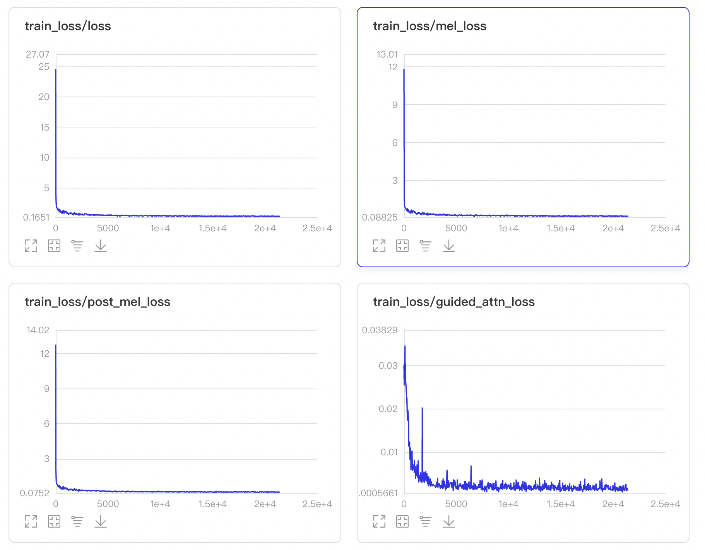
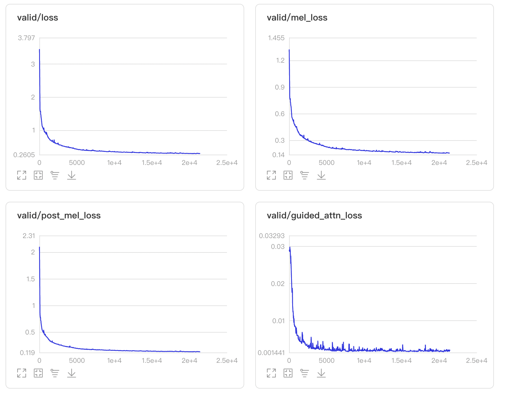
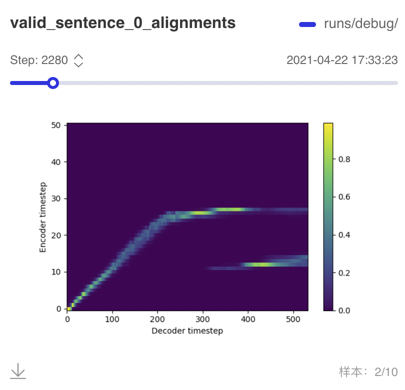

## Tacotron2 + AISHELL-3 数据集训练语音克隆模型

本实验的内容是利用 AISHELL-3 数据集和 Tacotron 2 模型进行语音克隆任务，使用的模型大体结构和论文 [Transfer Learning from Speaker Verification to Multispeaker Text-To-Speech Synthesis](https://arxiv.org/pdf/1806.04558.pdf) 相同。大致步骤如下：

1. Speaker Encoder: 我们使用了一个 Speaker Verification 任务训练一个 speaker encoder。这部分任务所用的数据集和训练 Tacotron 2 的数据集不同，因为不需要 transcription 的缘故，我们使用了较多的训练数据，可以参考实现 [ge2e](../ge2e)。
2. Synthesizer: 然后使用训练好的 speaker encoder 为 AISHELL-3 数据集中的每个句子生成对应的 utterance embedding. 这个 Embedding 作为 Tacotron 模型中的一个额外输入和 encoder outputs 拼接在一起。
3. Vocoder: 我们使用的声码器是 WaveFlow，参考实验 [waveflow](../waveflow).

## 数据处理

### utterance embedding 的生成

使用训练好的 speaker encoder 为 AISHELL-3 数据集中的每个句子生成对应的 utterance embedding. 以和音频文件夹同构的方式存储。存储格式是 `.npy` 文件。

首先 cd 到 [ge2e](../ge2e) 文件夹。下载训练好的 [模型](https://paddlespeech.bj.bcebos.com/Parakeet/ge2e_ckpt_0.3.zip)，然后运行脚本生成每个句子的 utterance embedding.

```bash
python inference.py --input=<intput> --output=<output> --device="gpu" --checkpoint_path=<pretrained checkpoint>
```

其中 input 是只包含音频文件夹的文件。这里可以用 `~/datasets/aishell3/train/wav`，然后 output 是用于存储 utterance embed 的文件夹，这里可以用 `~/datasets/aishell3/train/embed`。Utterance embedding 会以和音频文件夹相同的文件结构存储，格式为 `.npy`.

utterance embedding 的计算可能会用几个小时的时间，请耐心等待。

### 音频处理

因为 AISHELL-3 数据集前后有一些空白，静音片段，而且语音幅值很小，所以我们需要进行空白移除和音量规范化。空白移除可以简单的使用基于音量或者能量的方法，但是效果不是很好，对于不同的句子很难取到一个一致的阈值。我们使用的是先利用 Force Aligner 进行文本和语音的对齐。然后根据对齐结果截除空白。

我们使用的工具是 Montreal Force Aligner 1.0. 因为 aishell 的标注包含拼音标注，所以我们提供给 Montreal Force Aligner 的是拼音 transcription 而不是汉字 transcription. 而且需要把其中的韵律标记(`$` 和 `%`)去除，并且处理成 Montreal Force Alinger 所需要的文件形式。和音频同名的文本文件，扩展名为 `.lab`.

此外还需要准备词典文件。其中包含把拼音序列转换为 phone 序列的映射关系。在这里我们只做声母和韵母的切分，而声调则归为韵母的一部分。我们使用的[词典文件](./lexicon.txt)可以下载。

准备好之后运行训练和对齐。首先下载 [Montreal Force Aligner 1.0](https://github.com/MontrealCorpusTools/Montreal-Forced-Aligner/releases/tag/v1.0.1).下载之后解压即可运行。cd 到其中的 bin 文件夹运行命令，即可进行训练和对齐。前三个命令行参数分别是音频文件夹的路径，词典路径和对齐文件输出路径。可以通过`-o` 传入训练得到的模型保存路径。

```bash
./mfa_train_and_align \
  ~/datasets/aishell3/train/wav \
  lexicon.txt \
  ~/datasets/aishell3/train/alignment \
  -o aishell3_model \
  -v
```

因为训练和对齐的时间比较长。我们提供了对齐后的 [alignment 文件](https://paddlespeech.bj.bcebos.com/Parakeet/alignment_aishell3.tar.gz)，其中每个句子对应的文件为 `.TextGrid` 格式的文本。

得到了对齐文件之后，可以运行 `process_wav.py` 脚本来处理音频。

```bash
python process_wav.py --input=<input> --output=<output> --alignment=<alignment>
```

默认 input, output, alignment 分别是 `~/datasets/aishell3/train/wav`, `~/datasets/aishell3/train/normalized_wav`, `~/datasets/aishell3/train/alignment`.

处理结束后，会将处理好的音频保存在 `<output>` 文件夹中。

### 转录文本处理

把文本转换成为 phone 和 tone 的形式，并存储起来。值得注意的是，这里我们的处理和用于 montreal force aligner 的不一样。我们把声调分了出来。这是一个处理方式，当然也可以只做声母和韵母的切分。

运行脚本处理转录文本。

```bash
python preprocess_transcription.py --input=<input> --output=<output>
```

默认的 input 是 `~/datasets/aishell3/train`，其中会包含 `label_train-set.txt` 文件，处理后的结果会 `metadata.yaml` 和 `metadata.pickle`. 前者是文本格式，方便查看，后者是二进制格式，方便直接读取。

### mel 频谱提取

对处理后的音频进行 mel 频谱的提取，并且以和音频文件夹同构的方式存储，存储格式是 `.npy` 文件。

```python
python extract_mel.py --input=<intput> --output=<output>
```

input 是处理后的音频所在的文件夹，output 是输出频谱的文件夹。

## 训练

运行脚本训练。

```python
python train.py --data=<data> --output=<output> --device="gpu"
```

我们的模型去掉了 tacotron2 模型中的 stop token prediction。因为实践中由于 stop token prediction 是一个正负样例比例极不平衡的问题，每个句子可能有几百帧对应负样例，只有一帧正样例，而且这个 stop token prediction 对音频静音的裁切十分敏感。我们转用 attention 的最高点到达 encoder 侧的最后一个符号为终止条件。

另外，为了加速模型的收敛，我们加上了 guided attention loss, 诱导 encoder-decoder 之间的 alignment 更快地呈现对角线。

可以使用 visualdl 查看训练过程的 log。

```bash
visualdl --logdir=<output> --host=$HOSTNAME
```

示例 training loss / validation loss 曲线如下。







大约从训练 2000 步左右就从 validation 过程中产出的 alignement 中可以观察到模糊的对角线。随着训练步数增加，对角线会更加清晰。但因为 validation 也是以 teacher forcing 的方式进行的，所以要在真正的 auto regressive 合成中产出的 alignment 中观察到对角线，需要更长的时间。

## 预训练模型

预训练模型下载链接。[tacotron2_aishell3_ckpt_0.3.zip](https://paddlespeech.bj.bcebos.com/Parakeet/tacotron2_aishell3_ckpt_0.3.zip).

## 使用

本实验包含了一个简单的使用示例，用户可以替换作为参考的声音以及文本，用训练好的模型来合成语音。使用方式参考 [notebook](./voice_cloning.ipynb) 上的使用说明。
